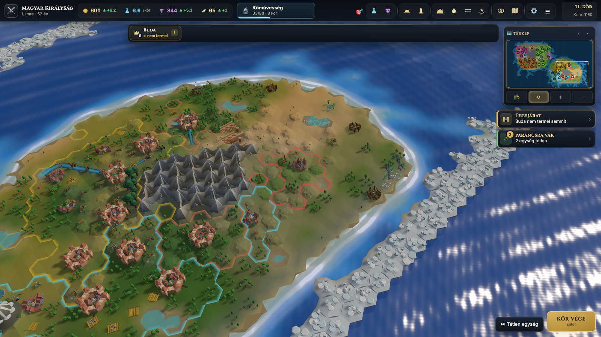
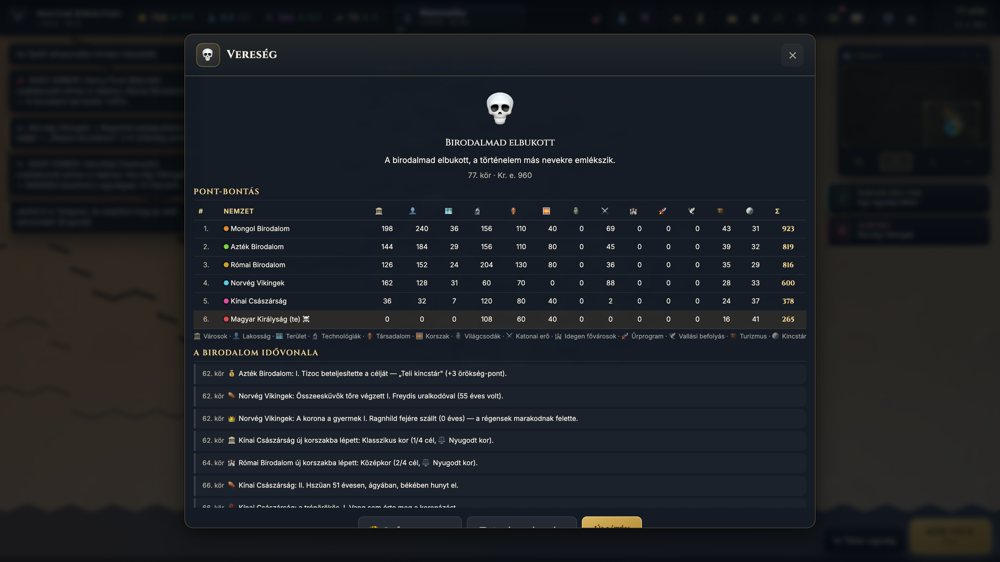
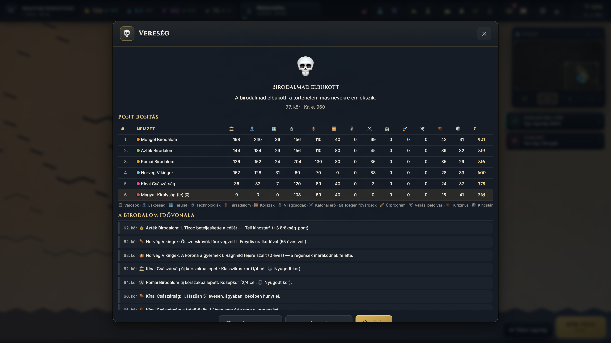

# 🏛️ Birodalmak (Empires) — 3D Civilization-Inspired 4X Browser Game

> **Category:** 3D Civilization / 4X Hex Strategy Clone  
> **Repository:** [lospolosadwords-dev/birodalmak](https://github.com/lospolosadwords-dev/birodalmak)  
> **Developer / Account:** Los Polos Amigos Kft. (Hungarian Indie Print Shop / Solo Creators)  
> **License:** MIT (Code) / CC0 (Assets from Kenney.nl)  
> **Stars:** Small account (< 15 stars)  
> **AI Assistance:** Built with **Claude Code**  
> **Live Playable Link:** [skynet.lospolo.hu/birodalmak/en/](https://skynet.lospolo.hu/birodalmak/en/)  

---

## 📸 In-Game Screenshots

| 3D Hex World View (Three.js) | Full Tech Tree (52 Techs with Eurekas) |
| :---: | :---: |
|  |  |

| Royal Dynasty & Succession System | City Management & Building Production |
| :---: | :---: |
|  |  |

---

## 🌟 Project Overview
**Birodalmak (Empires)** is a comprehensive, turn-based 4X strategy game directly inspired by Sid Meier's *Civilization VI*, running natively inside any modern browser. The game is developed by a small independent team in Hungary using **Claude Code**.

Remarkably, it requires **no game engine, no framework, and no build step**: it runs as native ES modules using HTML5 `<canvas>` for the classic map and **Three.js** for full 3D rendering.

---

## 🎮 Key Features & Mechanics
- **3D Hexagonal World:**
  - 4 world generation types: *Continents*, *Pangaea*, *Archipelago*, *Highlands*.
  - Procedural 3D terrain rendering with Three.js (hills, mountains, rivers, biomes).
  - Dynamic day/night cycle, seasons, and weather effects.
  - Realistic multi-stage Fog of War.
- **Empire & Progression:**
  - **52 Technologies** with historical **Eurekas** (Civ 6 style boosts).
  - **24 Civics** with Inspirations.
  - **10 Governments** + modular Policy Cards.
  - **46 Buildings & 18 World Wonders**.
  - City amenities, housing, population growth, and unrest.
- **Tactical Warfare:**
  - 49 unit types with 56 promotional upgrades.
  - Zone of Control (ZoC), flanking bonuses, high ground advantage.
  - Dedicated wall health and siege mechanics.
  - **Army Formations:** Units merge into armies commanded with strategic orders, named generals with personal traits, supply lines, and morale.
- **Dynasty & Politics:**
  - Royal dynasty simulation with 4 succession laws, legitimacy, dynastic marriages, pretender wars, and court offices.
  - Religion with pantheons and custom beliefs, great people, and city-state envoys.
  - 5 Victory conditions: *Domination, Science, Culture, Religion, Score*.

---

## 🛠️ Tech Stack & Architecture
- **Rendering:** Three.js (r128) for 3D view + 2D Canvas for overview map.
- **Architecture:** Flat array axial hex math (`idx = row * W + col`).
- **Event-Driven:** Deterministic decoupled event bus (`core/state.js`) preventing circular dependencies.
- **Storage & Multiplayer:** Client-side local storage; optional lightweight PHP relay for 2–4 player multiplayer.

---

## 🚀 How to Clone & Run Locally
There is **zero build step** and nothing to compile.

```bash
# 1. Clone the repository
git clone https://github.com/lospolosadwords-dev/birodalmak.git
cd birodalmak

# 2. Serve with any static HTTP server
python -m http.server 8177

# 3. Open your browser
# English version: http://localhost:8177/en/
# Hungarian version: http://localhost:8177/
```

---

## 💡 Why This Project is Great to Copy & Learn From
1. **Zero Toolchain Friction:** You can clone it and immediately edit any JavaScript file; refresh the browser and see changes instantly without `npm run build` or Vite.
2. **Gold Standard Civ Mechanics:** Contains clean, readable algorithms for city production queues, hex pathfinding, tech trees, and military combat resolution.
3. **Dual 2D/3D Rendering:** Perfect blueprint for showing how to toggle between an efficient 2D tactical hex map and an immersive Three.js 3D camera.
