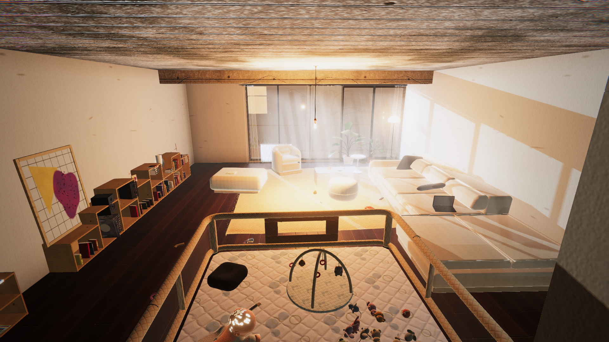
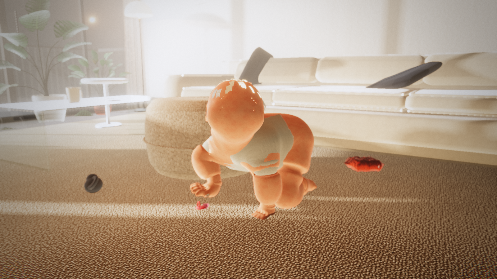
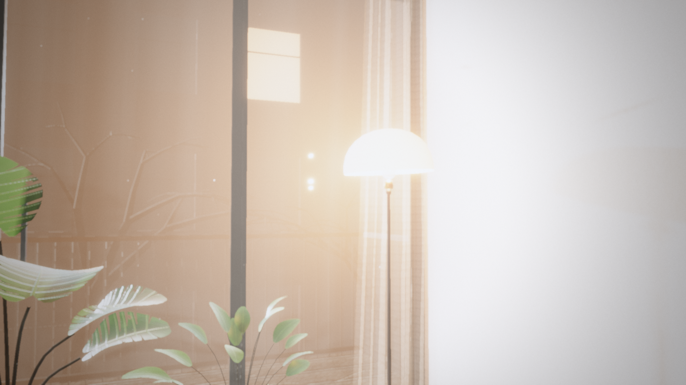

# 🐱 Operación Siesta — 3D Stealth Comedy Game Built by 71 AI Subagents

> **Category:** 3D AI-Built Game / Solo Agentic Engineering  
> **Repository:** [alandaitch/operacion-siesta](https://github.com/alandaitch/operacion-siesta)  
> **Developer / Creator:** Alan Daitch (`alandaitch`)  
> **License:** Open Source  
> **Stars:** Small account (10 stars)  
> **AI Architecture:** **Built end-to-end by 71 Claude Code Subagents**  
> **Live Demo:** WebGL / Browser  

---

## 📸 In-Game Screenshots

| Baby Room Stealth Gameplay | Sleeping Baby Detection Mechanic |
| :---: | :---: |
|  |  |

| Curtain Sabotage & Environment Interaction |
| :---: |
|  |

---

## 🌟 Project Overview
**Operación Siesta** is a humorous 3D stealth game in which the player controls an undercover operative cat whose mission is to sneak through a suburban home and neutralize noisy household items (blenders, vacuum cleaners, noisy toys, clocks) before they wake up a sleeping baby.

What makes this project extraordinary is its development methodology: **The entire game was generated autonomously by 71 specialized Claude Code subagents working together in parallel**, establishing a benchmark for agentic game development.

---

## 🎮 Key Features & Mechanics
- **100% Procedural Generation (Zero External Assets):**
  - **No external 3D models:** Every character, room, furniture, and item is constructed procedurally via Signed Distance Functions (SDFs) and algorithmic mesh geometry.
  - **No external image textures:** All materials, patterns, and surface textures are generated algorithmically at runtime using HTML5 Canvas procedures.
  - **No external sound files:** All audio (cat footsteps, purring, baby cries, alarms, ambient music) is synthesized live via the Web Audio API using oscillators and frequency envelopes.
- **Stealth & Sound Propagation Mechanics:**
  - A dynamic sound wave emission system where player movements and falling objects produce expanding sound spheres.
  - The baby has an awakening threshold gauge that reacts dynamically to ambient decibel levels.
- **Physics & Interactables:**
  - Integrated with **Rapier3D physics engine** for realistic rigid-body physics, knock-over items, sliding curtains, and dynamic ragdoll reactions.

---

## 🛠️ Tech Stack & Architecture
- **Rendering Engine:** Three.js (r170) + WebGL2.
- **Physics Engine:** `@dimforge/rapier3d-compat` (Wasm-based physics).
- **Audio System:** Web Audio API procedural synthesis.
- **Build System:** Vite + TypeScript.
- **Agent Coordination:** Multi-agent pipeline orchestrated with task specs and automated verification passes.

---

## 📋 How to Clone & Run

```bash
git clone https://github.com/alandaitch/operacion-siesta.git
cd operacion-siesta
npm install
npm run dev
```

Open `http://localhost:5173` in your browser to play immediately.
