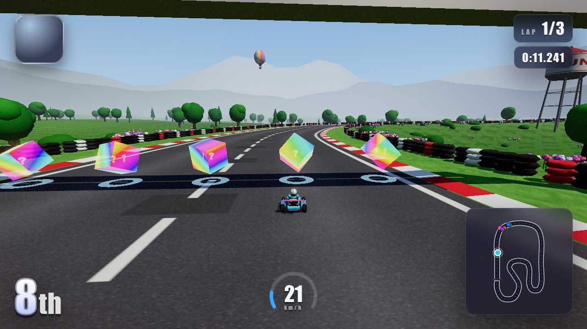

# 🏎️ Turbo Kart Rush — 3D Mario Kart Clone Built from 1 Prompt by 5 AI Agents

> **Category:** 3D Arcade Racing / Multi-Agent AI Generation  
> **Repository:** [bridge-mind/turbo-kart-rush](https://github.com/bridge-mind/turbo-kart-rush)  
> **Developer / Account:** `bridge-mind`  
> **License:** MIT License  
> **Stars:** Small account (37 stars)  
> **AI Architecture:** **5 Claude Fable 5.1 Sub-Agents working from 1 master prompt**  
> **Live Playable Link:** [bridge-mind.github.io/turbo-kart-rush/](https://bridge-mind.github.io/turbo-kart-rush/)  

---

## 📸 In-Game Screenshots

| Title & Mode Selection | Character & Kart Selection Screen |
| :---: | :---: |
|  |  |

| Track & Championship Selection | In-Game 3D Kart Racing Action |
| :---: | :---: |
|  |  |

---

## 🌟 Project Overview
**Turbo Kart Rush** is a full-featured, 3D arcade kart racing game directly inspired by Nintendo's *Mario Kart* and *Crash Team Racing*. It runs at 60 FPS in any browser with zero plugins.

The developer created the entire game from scratch by sending **a single prompt to Claude Code**, which automatically spawned five specialized sub-agents:
1. **Core Physics & Vehicle Controller Agent** (Drift mechanics, momentum, suspension)
2. **Track & Environment Generation Agent** (Spline curves, elevation, checkpoints)
3. **Item & Weapon System Agent** (Bananas, homing shells, speed boosts, invincibility)
4. **Procedural 3D Art & Character Agent** (Procedural karts, driver models, textures)
5. **UI, Audio & Game Loop Agent** (Menus, countdown, HUD, Web Audio synth)

---

## 🎮 Key Features & Mechanics
- **Physics & Drifting:**
  - Real-time arcade vehicle dynamics with hop-to-drift mechanics, spark tiers (blue, orange, purple boost fire), and slipstreaming.
- **Full Item Box System:**
  - Mystery item boxes scattered on tracks dispensing turbo mushrooms, bananas, green shells, homing red shells, and lightning.
- **Roster & Tracks:**
  - 4 unique playable racers with differing weight, top speed, and handling profiles.
  - 4 distinct 3D tracks: *Neon Speedway, Desert Canyon, Glacier Ridge, Cosmic Rainbow*.
- **Zero Asset Dependencies:**
  - 100% procedural meshes (procedural tire treads, chassis, exhausts, tracks, skyboxes) and custom Web Audio SFX.

---

## 🛠️ Tech Stack & Architecture
- **Engine:** Three.js (v0.185) + WebGL2.
- **Language:** TypeScript with strict type-safety.
- **Bundler:** Vite 8.
- **Design Pattern:** Contract-driven component architecture (`CONTRACT.md`) preventing state pollution across agent domains.

---

## 📋 How to Clone & Run

```bash
git clone https://github.com/bridge-mind/turbo-kart-rush.git
cd turbo-kart-rush
npm install
npm run dev
```

Open `http://localhost:5178` to play or test with gamepad / keyboard controls (`WASD` / Arrow keys, `Space` for drift/hop, `Shift` for item).
