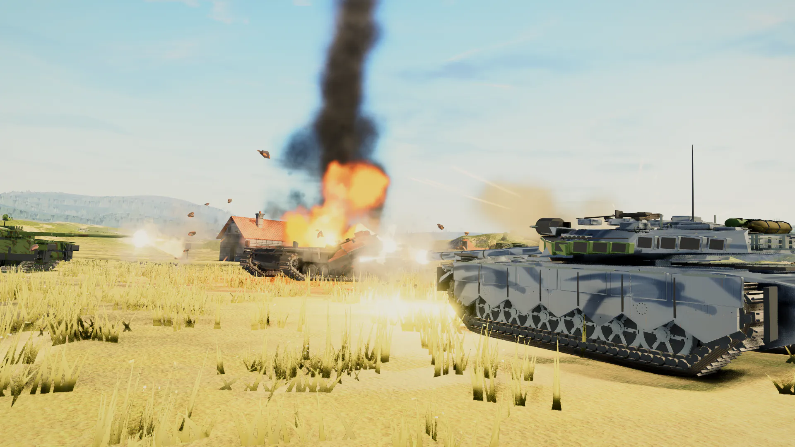
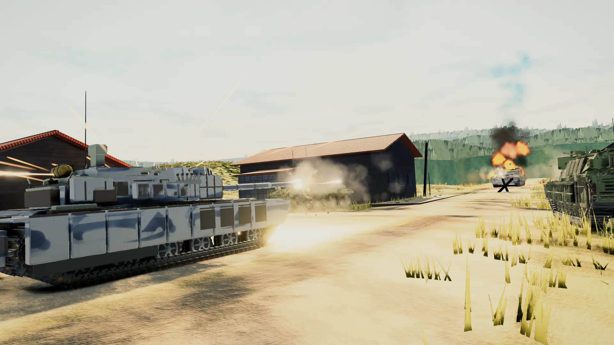
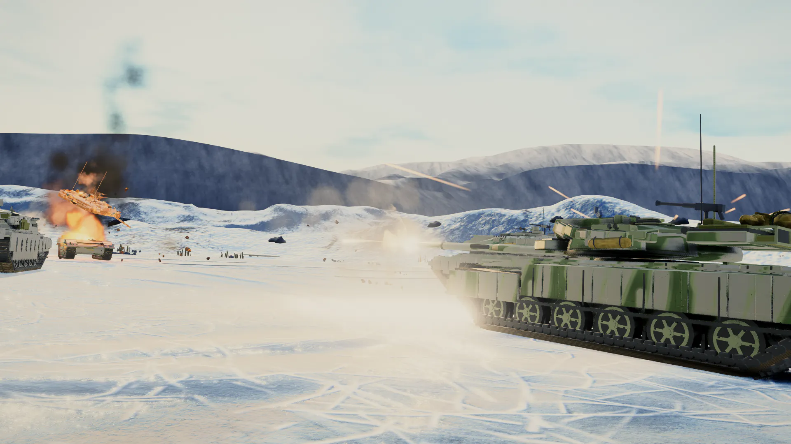

# 🛡️ Claude of Tanks — Browser 3D Armored Combat Simulator

> **Category:** 3D Tactical Combat / AI-Engineered Simulator  
> **Repository:** [Kevin-Liu-01/Claude-of-Tanks](https://github.com/Kevin-Liu-01/Claude-of-Tanks)  
> **Developer / Account:** Kevin Liu (`Kevin-Liu-01`)  
> **License:** MIT License  
> **Stars:** Small account (25 stars)  
> **AI Assistance:** Co-engineered via **Claude Code & OpenAI Codex**  
> **Live Demo:** Browser / WebGL  

---

## 📸 In-Game Screenshots

| Coastal Ambush Battle Scene | Seafront Tank Duel |
| :---: | :---: |
|  |  |

| Winter Lake Duel Arena |
| :---: |
|  |

---

## 🌟 Project Overview
**Claude of Tanks** is a high-performance 3D tank combat simulator built directly for the web browser. Inspired by *World of Tanks* and *War Thunder*, it simulates authentic ballistics, armor angling, turret traverse rates, and terrain deformation without requiring heavy downloads or proprietary game engines.

The repository was built through an iterative AI coding workflow where automated Playwright validation scripts tested tank physics, shell trajectory math, and AI pathfinding after every agent iteration.

---

## 🎮 Key Features & Mechanics
- **Realistic Ballistics & Armor System:**
  - Calculations for shell velocity, gravity drop, armor thickness, and impact angle ricochets.
  - Multi-ammo system: Armor-Piercing (AP), High Explosive (HE), and Armor-Piercing Composite Rigid (APCR).
- **Tread & Suspension Simulation:**
  - Independent tread track raycasting conforming each wheel to bumpy heightmap terrain.
- **Tactical AI Opponents:**
  - Enemy AI that evaluates line of sight, utilizes hull-down positions, angles their armor, and retreats when reloaded.
- **Dynamic 3D Environments:**
  - 3 large battle arenas: *Coastal Cliffs*, *Industrial Port Seafront*, and *Frozen Winter Lake*.
  - Particle systems for muzzle flashes, dust kick-up, smoke plumes, and explosion debris.

---

## 🛠️ Tech Stack & Architecture
- **Rendering:** Three.js + WebGL2.
- **Math & Physics:** Custom deterministic physics solver for tread vehicles and projectile trajectory.
- **Audio:** Web Audio API with layered mechanical motor pitch modulation, tread clanking, and concussive cannon sound waves.
- **Language:** TypeScript + Vite.

---

## 📋 How to Clone & Run

```bash
git clone https://github.com/Kevin-Liu-01/Claude-of-Tanks.git
cd Claude-of-Tanks
npm install
npm run dev
```

Navigate to `http://localhost:5173`. Controls: `WASD` for hull steering, Mouse for turret aiming, `Left Click` to fire, `Shift` for sniper sight zoom.
