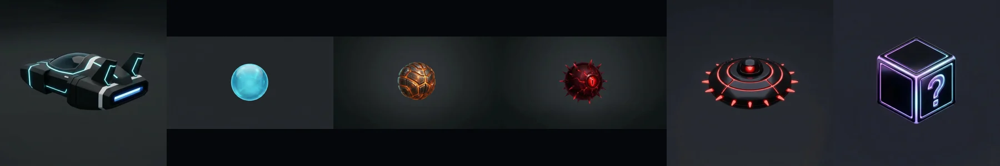
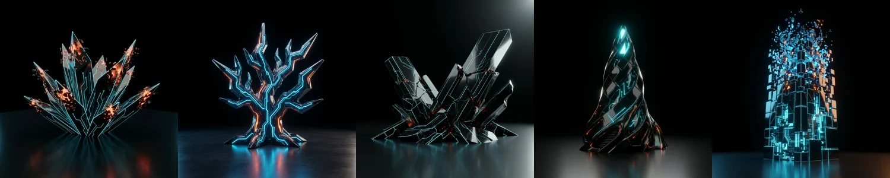
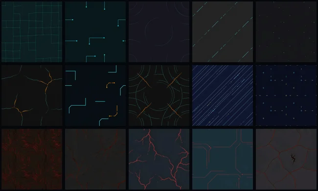
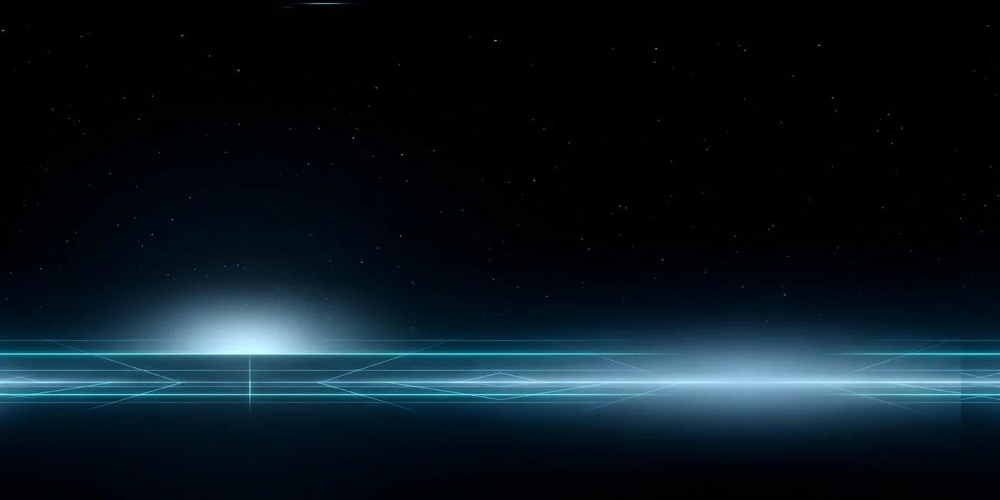

# ⚡ Tron Exonix — 3D Neon Arcade Game in Godot 4.7 Built via MCP AI

> **Category:** 3D Arcade / Godot MCP Autonomous Development  
> **Repository:** [witnesstodark/tron-exonix](https://github.com/witnesstodark/tron-exonix)  
> **Developer / Account:** `witnesstodark`  
> **License:** Open Source  
> **Stars:** Small account (9 stars)  
> **AI Stack:** **Claude Code + Godot MCP + Blender MCP + TripoAI + fal.ai**  
> **Engine:** Godot Engine 4.7 (Forward+ 3D Renderer)  

---

## 📸 In-Game Screenshots

| Cybernetic Cast & Player Avatar | Obstacles, Drones & Grid Hazards |
| :---: | :---: |
|  |  |

| Procedural PBR Neon Materials | Cyberpunk Skybox Panorama |
| :---: | :---: |
|  |  |

---

## 🌟 Project Overview
**Tron Exonix** is a vibrant 3D arcade puzzle-action game inspired by classic *AirXonix* and the *TRON* aesthetic. The player controls a cyber-recon vessel navigating elevated digital arenas, claiming grid territory by drawing light trails while evading bouncing cyber-spikes, hunter drones, and laser boundaries.

This game serves as a state-of-the-art case study in **MCP-enabled multi-tool AI game development**: Claude Code orchestrated Godot MCP to run playtests and capture stack traces, Blender MCP to verify 3D mesh pivots, TripoAI to generate GLB models, and fal.ai for PBR textures and atmospheric skyboxes.

---

## 🎮 Key Features & Mechanics
- **3D Grid-Capturing Mechanics:**
  - Real-time polygon partition algorithm in 3D: drawing closed loops of light converts empty space into solid neon terrain.
- **AI-Generated 3D Assets:**
  - Player ship, hunter drones, and collectible cyber-orbs generated via TripoAI text-to-3D.
  - PBR neon emission textures, normal maps, and HDR skyboxes generated via fal.ai diffusion pipelines.
- **Custom Shaders:**
  - High-intensity bloom, scanline CRT post-processing, and dynamic light grid pulses coded in Godot 4 shading language.
- **Full Sound Suite:**
  - Retro synthwave soundtrack and high-impact digital sound effects.

---

## 🛠️ Tech Stack & Architecture
- **Game Engine:** Godot 4.7 with Forward+ 3D rendering pipeline.
- **Scripting:** GDScript 2.0 with type hints.
- **AI Automation:** Custom Model Context Protocol (MCP) server bridge connecting Godot editor CLI directly to Claude Code.

---

## 📋 How to Clone & Run

```bash
git clone https://github.com/witnesstodark/tron-exonix.git
```

1. Download and open **Godot Engine 4.7+**.
2. Click **Import** and select the `project.godot` file in the cloned directory.
3. Press **F5** (or the Play icon) to execute the main scene (`res://scenes/main.tscn`).
