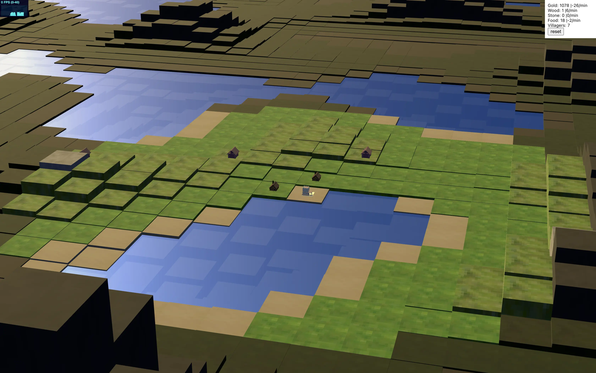

# 🌍 Taal — 3D Procedural Cubic World Civ & Anno Hybrid

> **Category:** 3D Strategy / Procedural 4X & Economy  
> **Repository:** [Resaki1/taal](https://github.com/Resaki1/taal)  
> **Developer / Author:** Christian Reski (`Resaki1`)  
> **License:** MIT License  
> **Stars:** Small account (13 stars)  
> **Tech Stack:** React Three Fiber (`@react-three/fiber`), Three.js, TypeScript  
> **Live Demo:** [taal.web.app](https://taal.web.app)  

---

## 📸 In-Game Screenshots

| 3D Procedural Cubic Archipelago & City Hub |
| :---: |
|  |

---

## 🌟 Project Overview
**Taal** is an open-source 3D browser strategy game that blends the strategic exploration and civilization building of *Sid Meier's Civilization* with the intricate logistics, resource supply chains, and production island loops of the *Anno* series.

Set within an infinite procedurally generated cubic/voxel landscape, players establish colonial harbors, harvest raw timber and ores, transport goods, and expand across oceanic biomes.

---

## 🎮 Key Features & Mechanics
- **Infinite Procedural Cubic Worlds:**
  - Simplex noise-driven terrain generator producing archipelago islands, mountainous plateaus, deep oceanic trenches, and sandy coastlines.
- **Civilization & Anno Mechanics:**
  - Grid-based placement of production buildings (lumberjacks, smelters, farms, storage depots).
  - Production yield loops: raw goods transported along connected paths to refinement mills.
  - Population tiers with escalating luxury and sustenance demands.
- **Fluid 3D Camera & Interaction:**
  - Smooth orbital camera controls with pinch-to-zoom, panning, tile picking, and elevation indicators.
- **Optimized Instanced Rendering:**
  - Uses Three.js instanced meshes to render thousands of cubic blocks at 60+ FPS on mobile and desktop web browsers.

---

## 🛠️ Tech Stack & Architecture
- **Framework:** React 18 + React Three Fiber (`@react-three/fiber`) + Drei.
- **State Management:** Zustand for lightning-fast reactive game state without React re-render overhead.
- **Language:** TypeScript.
- **Hosting:** Firebase Hosting with automated GitHub Actions CI/CD.

---

## 📋 How to Clone & Run

```bash
git clone https://github.com/Resaki1/taal.git
cd taal
npm install
npm start
```

Open `http://localhost:3000` to launch the local development server.
