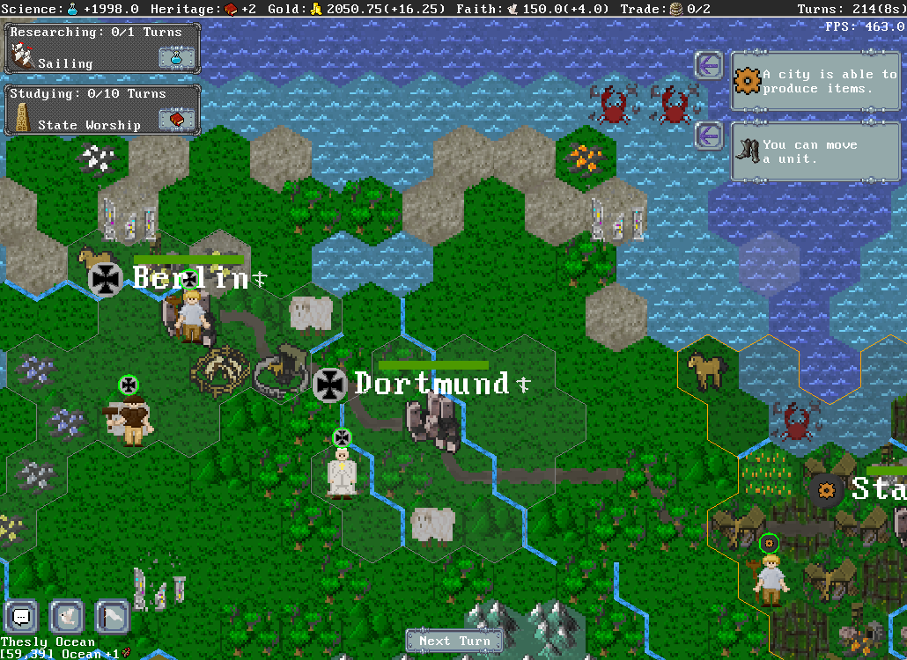

# 🏛️ OpenCiv — Open-Source Browser Civilization V/VI Clone

> **Category:** 3D & Isometric Civilization / Web 4X Clone  
> **Repository:** [RyanGrieb/OpenCiv](https://github.com/RyanGrieb/OpenCiv)  
> **Developer / Author:** Ryan Grieb (`RyanGrieb`)  
> **License:** MIT License  
> **Stars:** 200 stars  
> **AI Assistance:** Maintained with **Claude Code** (`CLAUDE.md` standard)  
> **Architecture:** Full-stack TypeScript + WebGL / Canvas client + WebSocket server  

---

## 📸 In-Game Screenshots

| OpenCiv 4X Gameplay, Tech Tree & City View |
| :---: |
|  |

---

## 🌟 Project Overview
**OpenCiv** is a dedicated open-source reimplementation of *Civilization V and VI* built specifically for modern web browsers. It provides a complete multiplayer 4X experience with turn resolution, city founding, full research trees, and military maneuvering.

The repository is maintained with a comprehensive `CLAUDE.md` protocol that details coding standards, sprite atlas packing conventions, and automated test commands for AI pair programmers.

---

## 🎮 Key Features & Mechanics
- **Civilization Core Systems:**
  - Comprehensive technology tree with prerequisites, science point generation, and era progressions.
  - City founding via Settlers, district growth, citizen tile allocation, food starvation / growth curves, and production queues.
  - Combat units (Warriors, Archers, Scouts, Catapults) with terrain movement penalties and combat strength modifiers.
- **Infinite Looping World Map:**
  - Procedural hex/isometric world generation with seamless horizontal world-wrapping (circumnavigation).
  - Civilization-accurate 2-tier Fog of War (unexplored black / shroud memory / live sight).
- **Multiplayer Ready:**
  - Client-server architecture with Node.js WebSocket engine handling simultaneous turns and player actions.

---

## 🛠️ Tech Stack & Architecture
- **Client:** TypeScript, WebGL / HTML5 Canvas rendering, custom sprite packer.
- **Server:** Node.js, `ws` (WebSockets), headless game logic runner.
- **Design Pattern:** Client-server event reconciliation; shared deterministic game models.

---

## 📋 How to Clone & Run

```bash
git clone https://github.com/RyanGrieb/OpenCiv.git
cd OpenCiv
npm run install-all
npm start
```

This single command starts both the backend game server on port `2000` and the frontend client on port `1234`. Open `http://localhost:1234` in your browser.
