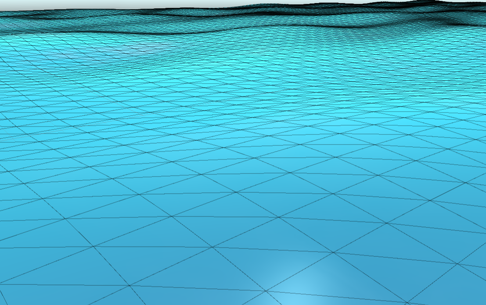
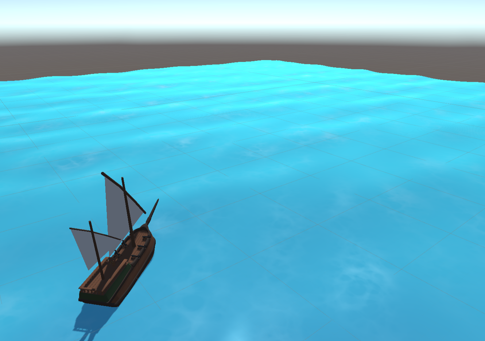

# 🌊 Pirates — Unity 3D Gerstner Wave Ocean Shader & Naval Buoyancy

> **Category:** 3D Pirate / Ocean Simulation & Naval AI  
> **Repository:** [maxematical/pirates](https://github.com/maxematical/pirates)  
> **Developer / Author:** `maxematical`  
> **License:** Open Source  
> **Stars:** Small account (2 stars)  
> **Engine:** Unity Engine (C#, HLSL ShaderLab)  

---

## 📸 In-Game Screenshots

| Dynamic Gerstner Ocean Waves | Worley Noise Foam & Surface Currents |
| :---: | :---: |
|  |  |

---

## 🌟 Project Overview
**Pirates** by `maxematical` is a high-fidelity 3D naval prototype built in Unity that implements mathematical Gerstner wave displacement shaders on the GPU synchronized with CPU volumetric buoyancy calculations for pirate sailing ships.

It is an ideal project for indie developers seeking to copy or adapt AAA-style ocean water mechanics, wake effects, and realistic ship physics into their own pirate games.

---

## 🎮 Key Features & Mechanics
- **Gerstner Wave Math in HLSL:**
  - Mathematical Gerstner wave displacement supporting multiple overlapping wave trains, wind direction vectors, and wavelength frequencies.
  - Dynamic GPU-to-CPU height queries allowing ship hulls to float accurately on choppy seas.
- **Worley Noise & Wave Crest Foam:**
  - Custom surface foam shader that dynamically activates on wave crests and around vessel hulls.
- **Naval AI & Combat:**
  - Autonomous AI-steered pirate ships with waypoint cruising, target interception, and broadside cannon volleys.

---

## 🛠️ Tech Stack & Architecture
- **Engine:** Unity 2022+ / Unity 6.
- **Shaders:** HLSL / ShaderLab custom vertex and fragment shaders.
- **Physics:** Rigidbody buoyancy script calculating hydrodynamic buoyant forces.

---

## 📋 How to Clone & Run

```bash
git clone https://github.com/maxematical/pirates.git
```

1. Launch **Unity Hub** and add the cloned `pirates` project.
2. Open `Assets/Scenes/Main.unity` (or Ocean test scene).
3. Press **Play** to test ship sailing, wave dynamics, and cannon fire.
