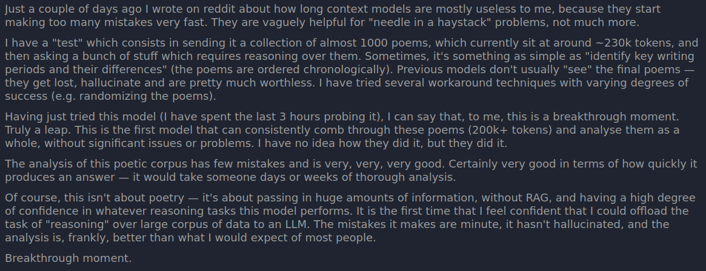
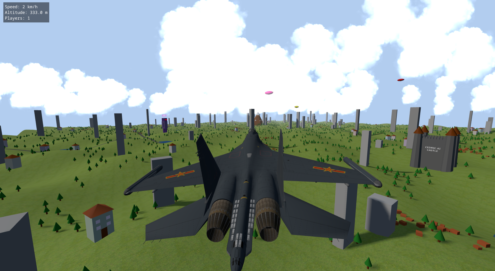
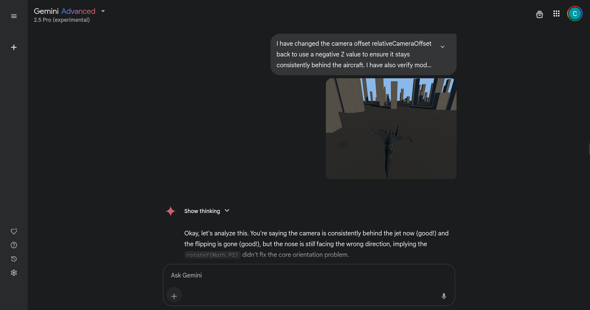

# ✈️ Vibe Jet — 3D Multiplayer Flight Simulator Vibe Coded with Gemini 2.5 Pro

> **Category:** 3D Flight / AI Vibe Coding Case Study  
> **Repository:** [cedrickchee/vibe-jet](https://github.com/cedrickchee/vibe-jet)  
> **Developer / Author:** Cedric Chee (`cedrickchee`)  
> **License:** MIT License  
> **Stars:** 69 stars  
> **AI Architecture:** **Gemini 2.5 Pro (Canvas + Thinking Mode) across 50+ prompts**  
> **Tech Stack:** Three.js, WebGL, WebSockets (`ws`), Node.js  

---

## 📸 In-Game Screenshots

| 3D Jet Cockpit & Island Flight | Third-Person Flight Visuals |
| :---: | :---: |
|  |  |

| Vibe Coding Prompt Engineering with Gemini 2.5 Pro |
| :---: |
|  |

---

## 🌟 Project Overview
**Vibe Jet** is a 3D multiplayer flight simulator developed entirely through "vibe coding" using **Google's Gemini 2.5 Pro** (Canvas mode and Thinking mode). The repository documents over 50 iterative prompts, showing how AI was guided from an empty HTML file to a functional 3D aerial flight simulator with networking.

Players can fly jet fighters over procedural tropical terrain, perform barrel rolls, bank into steep turns, and dogfight in real time against other players over WebSockets.

---

## 🎮 Key Features & Mechanics
- **Aerodynamic Flight Model:**
  - Authentic pitch, roll, yaw, lift, drag, and throttle calculations.
  - Afterburner boost mode with camera FOV kick and trailing heat haze particles.
- **Real-Time Multiplayer Networking:**
  - Lightweight Node.js WebSocket server synchronizing jet transform matrices, velocities, and projectile tracers across clients.
- **Low-Poly Procedural Environment:**
  - Procedural 3D islands, oceanic water reflections, runway tarmac, and sky dome.
- **Comprehensive AI Prompt Logs:**
  - The repository includes complete transcripts, comparisons with Claude 3.7 and o1-Pro, and architectural decisions made by Gemini.

---

## 🛠️ Tech Stack & Architecture
- **Frontend:** Vanilla JavaScript + Three.js + WebGL.
- **Backend:** Node.js + `ws` WebSocket library (`server.js`).
- **Assets:** Lightweight GLTF jet fighter models.

---

## 📋 How to Clone & Run

```bash
git clone https://github.com/cedrickchee/vibe-jet.git
cd vibe-jet
npm install

# Terminal 1: Client web server
npx serve

# Terminal 2: Multiplayer WebSocket server
node server.js
```

Open `http://localhost:3000` (or the URL printed by serve) in two browser windows to dogfight in multiplayer.
