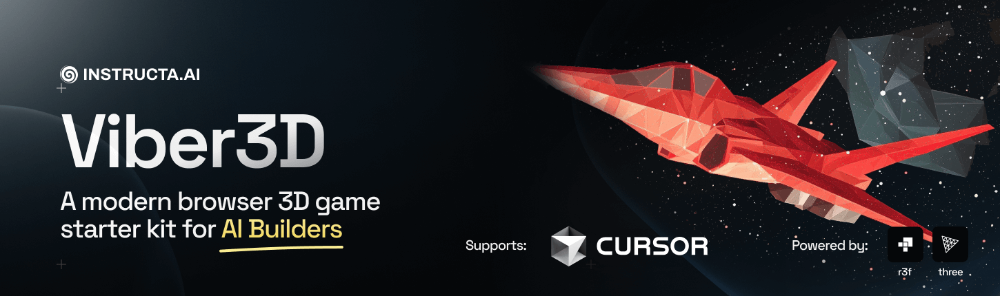

# 🚀 Space Fighter Game — 3D Space Shooter with React 19 & Koota ECS

> **Category:** 3D Space Combat / Modern ECS Architecture  
> **Repository:** [instructa/space-fighter-game](https://github.com/instructa/space-fighter-game)  
> **Developer / Creator:** Kevin Kern (`instructa`)  
> **License:** MIT License  
> **Stars:** Small account (1 star)  
> **Tech Stack:** React 19, `@react-three/fiber`, Three.js, `@pmndrs/koota` (ECS)  
> **Live Demo:** [viber3d-spacewars.kevinkern.dev](https://viber3d-spacewars.kevinkern.dev/)  

---

## 📸 In-Game Screenshots

| Viber3D Space Combat Banner & Architecture |
| :---: |
|  |

---

## 🌟 Project Overview
**Space Fighter Game** is a cutting-edge 3D space shooter built with **React 19**, **React Three Fiber**, and the new **Koota Entity Component System (ECS)**. It was developed using the **Viber3D** game engine starter kit and Cursor AI rules.

The project demonstrates high-performance entity management in React 3D games, maintaining hundreds of laser bolts, asteroids, and enemy space drones at a steady 60–120 FPS.

---

## 🎮 Key Features & Mechanics
- **Koota ECS Engine:**
  - High-performance cache-friendly entity component system handling thousands of active entities (lasers, enemies, particle debris) with zero React state overhead.
- **6-DOF Space Flight:**
  - 6 Degrees of Freedom spacecraft movement with inertial dampening, pitch, roll, boost trails, and laser turrets.
- **Asteroid Field Hazards:**
  - Procedural asteroid generation with fracturing destruction physics upon laser impact.
- **AI Prompt Rules Included:**
  - Contains `.cursor/rules` and `prompts/` directory for replicating this architecture with AI assistants.

---

## 🛠️ Tech Stack & Architecture
- **Framework:** React 19 + `@react-three/fiber` (v9).
- **ECS:** `@pmndrs/koota`.
- **Bundler:** Vite 6.2 + TypeScript.

---

## 📋 How to Clone & Run

```bash
git clone https://github.com/instructa/space-fighter-game.git
cd space-fighter-game
npm install
npm run dev
```

Open `http://localhost:5173` in your browser. Controls: Mouse / `WASD` to steer, `Space` to shoot, `Shift` for afterburners.
