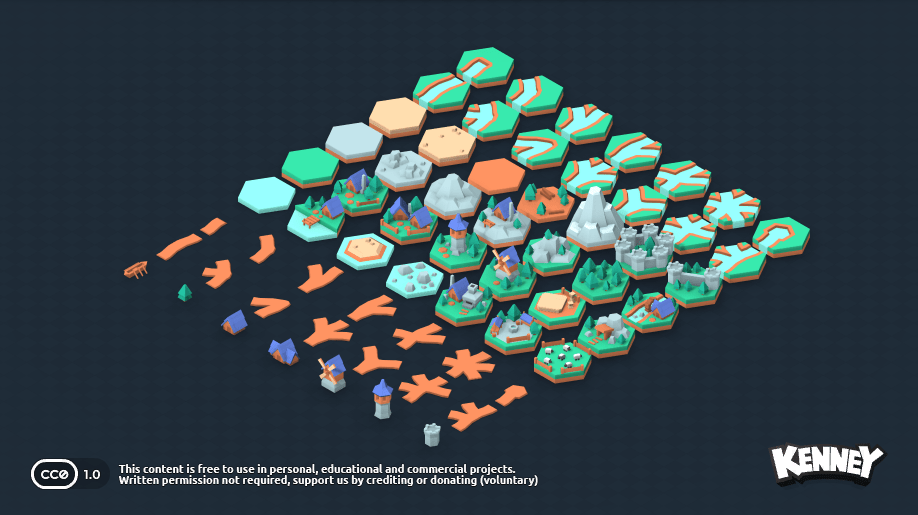

# 🦀 HexCiv & Bevy Hex Sandbox — Rust ECS Civilization VI Reimplementation

> **Category:** 3D Civilization / Rust Bevy Engine  
> **Repositories:** [teohhanhui/hexciv](https://github.com/teohhanhui/hexciv) & [dmlary/bevy-hex-sandbox](https://github.com/dmlary/bevy-hex-sandbox)  
> **Developers / Authors:** Teoh Han Hui (`teohhanhui`) & David Lary (`dmlary`)  
> **Licenses:** Apache-2.0 / MIT  
> **Stars:** Small accounts (5 stars & 20 stars)  
> **Tech Stack:** Rust 2024, Bevy Engine (`0.16.1`), `bevy_ecs_tilemap`, `bevy_matchbox`  

---

## 📸 In-Engine Screenshots

| Bevy 3D Hex Tilemap Sandbox & Kenney Hex Kit |
| :---: |
|  |

---

## 🌟 Project Overview
**HexCiv** is a Civilization VI inspired game engine built entirely in **Rust** using the high-performance **Bevy ECS** game engine. It represents the forefront of modern data-oriented 4X game architecture.

Coupled with **bevy-hex-sandbox**, developers have access to a complete Rust 3D hexagonal map editor utilizing Kenney's 3D hexagon kit, complete with camera navigation, tile placement, and WebRTC P2P multiplayer.

---

## 🎮 Key Features & Mechanics
- **Civ VI Accurate Terrain Layers:**
  - Layered hexagonal biomes: coast, desert, desert hills, mountains, grassland, plains, tundra, and ice sheets.
  - Hexagonal axial coordinate math with exact movement costs and defense modifiers.
- **Pure Data-Oriented Design (DOD):**
  - All game elements (units, tiles, cities, yields) are pure Bevy ECS components, enabling deterministic simulation and massive parallel execution.
- **P2P WebRTC Networking:**
  - Foundation for decentralized turn-based multiplayer powered by `bevy_matchbox`.

---

## 🛠️ Tech Stack & Architecture
- **Language:** Rust (edition 2021/2024).
- **Engine:** Bevy 0.16.
- **Networking:** WebRTC via Matchbox.
- **GUI:** `bevy_egui`.

---

## 📋 How to Clone & Run

```bash
# Clone HexCiv
git clone https://github.com/teohhanhui/hexciv.git
cd hexciv
cargo run

# Or clone Bevy Hex Sandbox
git clone https://github.com/dmlary/bevy-hex-sandbox.git
cd bevy-hex-sandbox
cargo run
```

Requires Rust 1.80+ installed via `rustup`.
