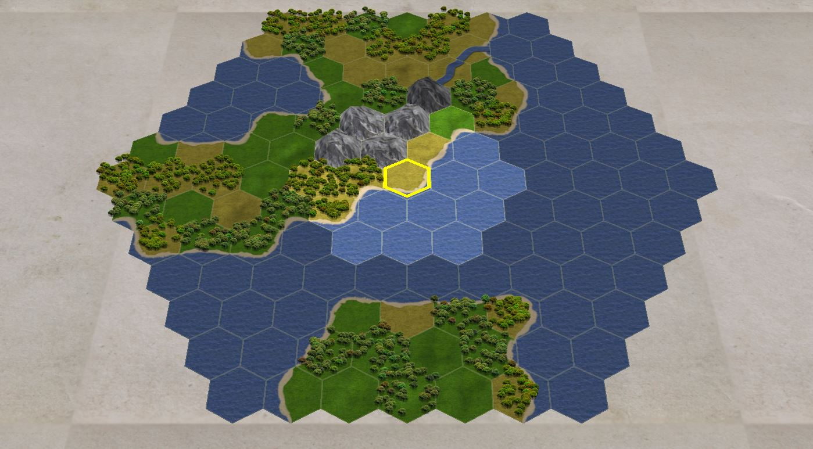

# 🗺️ Three.js Hex Map — Procedural 3D Hex Terrain with Civ Fog of War

> **Category:** 3D Civilization / Three.js Procedural Map  
> **Repository:** [Bunkerbewohner/threejs-hex-map](https://github.com/Bunkerbewohner/threejs-hex-map)  
> **Developer / Author:** `Bunkerbewohner`  
> **License:** MIT License  
> **Stars:** 119 stars  
> **Tech Stack:** TypeScript, Three.js, WebGL, Webpack  

---

## 📸 In-Engine Screenshots

| 3D Procedural Hex Terrain, Mountains, Coast & Rivers |
| :---: |
|  |

---

## 🌟 Project Overview
**threejs-hex-map** is a procedural 3D hexagonal terrain generator built with Three.js. It features a **two-tier Fog of War system directly modeled on Civilization**, realistic elevation blending, winding rivers, and procedural tree placement.

---

## 🎮 Key Features & Mechanics
- **Civilization-Style Fog of War:**
  - Tier 0: Unexplored (completely blacked out).
  - Tier 1: Explored (visible terrain geometry, but enemy units and building updates hidden).
  - Tier 2: Actively Visible (full color, live unit tracking).
- **Texture Atlas Blending:**
  - Smooth alpha transition masks between grass, sand, rock, snow, and water hex boundaries.
- **Winding River Generation:**
  - Rivers flow along hex edges from mountain peaks downward to the ocean with realistic branching.

---

## 🛠️ Tech Stack & Architecture
- **Graphics:** Three.js + WebGL.
- **Math:** Red Blob Games axial hex coordinate geometry.
- **Language:** TypeScript.

---

## 📋 How to Clone & Run

```bash
git clone https://github.com/Bunkerbewohner/threejs-hex-map.git
cd threejs-hex-map
npm install
npm start
```

Open `http://localhost:3000/examples/random/` in your browser.
