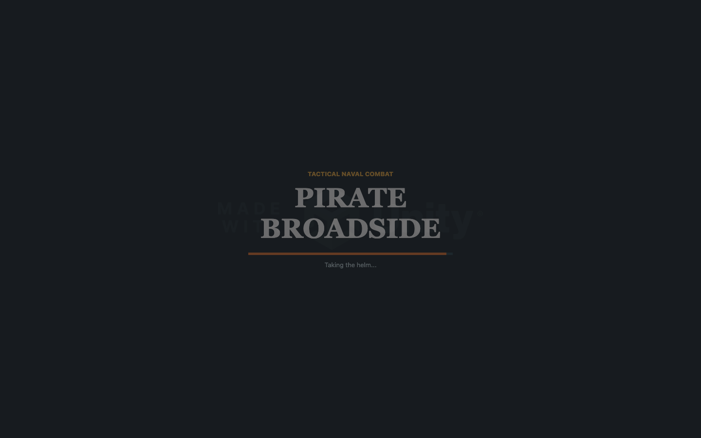
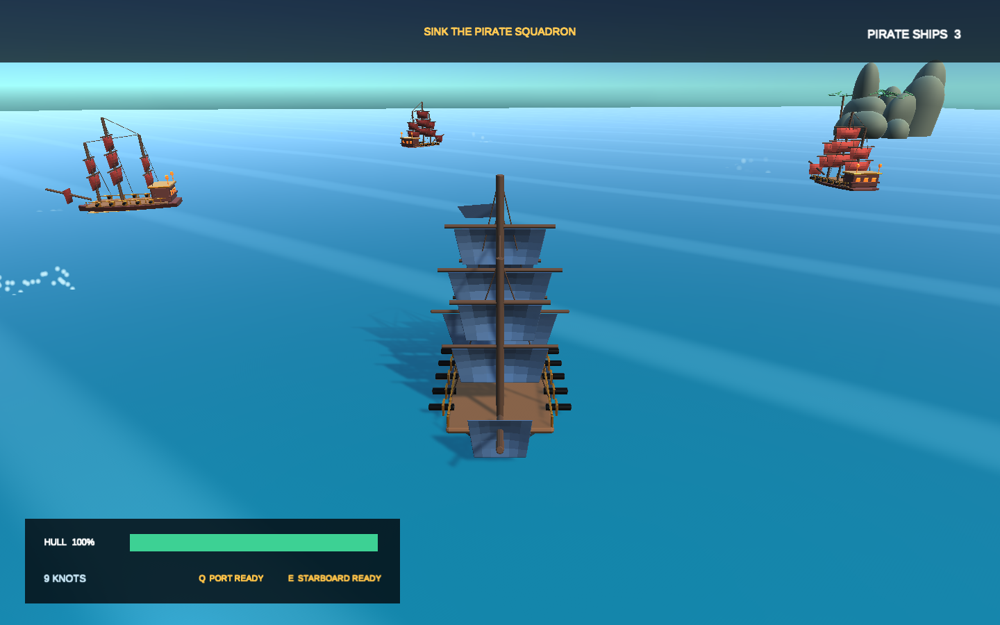

# 💣 Pirate Broadside — Fast-Paced Unity 6 Naval Battle Simulator

> **Category:** 3D Pirate / Tactical Naval Combat  
> **Repository:** [masafykun/pirate-broadside](https://github.com/masafykun/pirate-broadside)  
> **Developer / Author:** `masafykun`  
> **License:** MIT License  
> **Stars:** Small account (0 stars)  
> **Engine:** Unity 6 (C#, Custom Ocean Shader)  

---

## 📸 In-Game Screenshots

| Title & Battle Arena Setup | Intense Broadside Naval Combat Action |
| :---: | :---: |
|  |  |

---

## 🌟 Project Overview
**Pirate Broadside** is an action-packed 3D naval combat game built with Unity 6. The player commands a heavily armed galleon against aggressive pirate AI fleets. It features custom stylized ocean water shaders, realistic rudder and sail steering mechanics, and explosive cannon ballistics.

---

## 🎮 Key Features & Mechanics
- **Broadside Aiming Reticle:**
  - Dynamic arc prediction showing cannon shot trajectory based on ship roll and wave incline.
- **Custom Stylized Ocean Shader:**
  - High-performance vertex displacement water shader optimized for mobile and standalone PCs.
- **Tactical Fleet AI:**
  - Enemy ships circle the player to deliver broadsides while attempting to avoid crossing in front of the player's cannons.

---

## 🛠️ Tech Stack & Architecture
- **Engine:** Unity 6 (URP).
- **Language:** C#.
- **Assets:** Stylized pirate galleons, cannon FX, and particle smoke trails.

---

## 📋 How to Clone & Run

```bash
git clone https://github.com/masafykun/pirate-broadside.git
```

Open in **Unity 6**, load `Assets/Scenes/BattleScene.unity`, and click **Play**.
