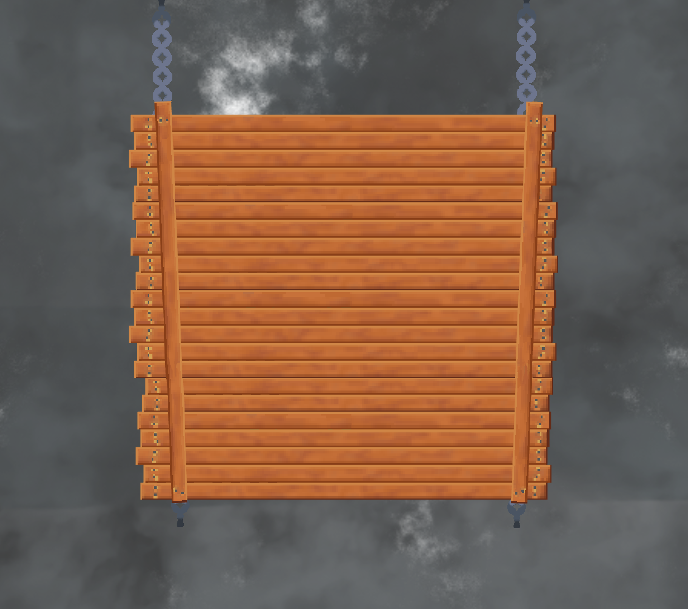
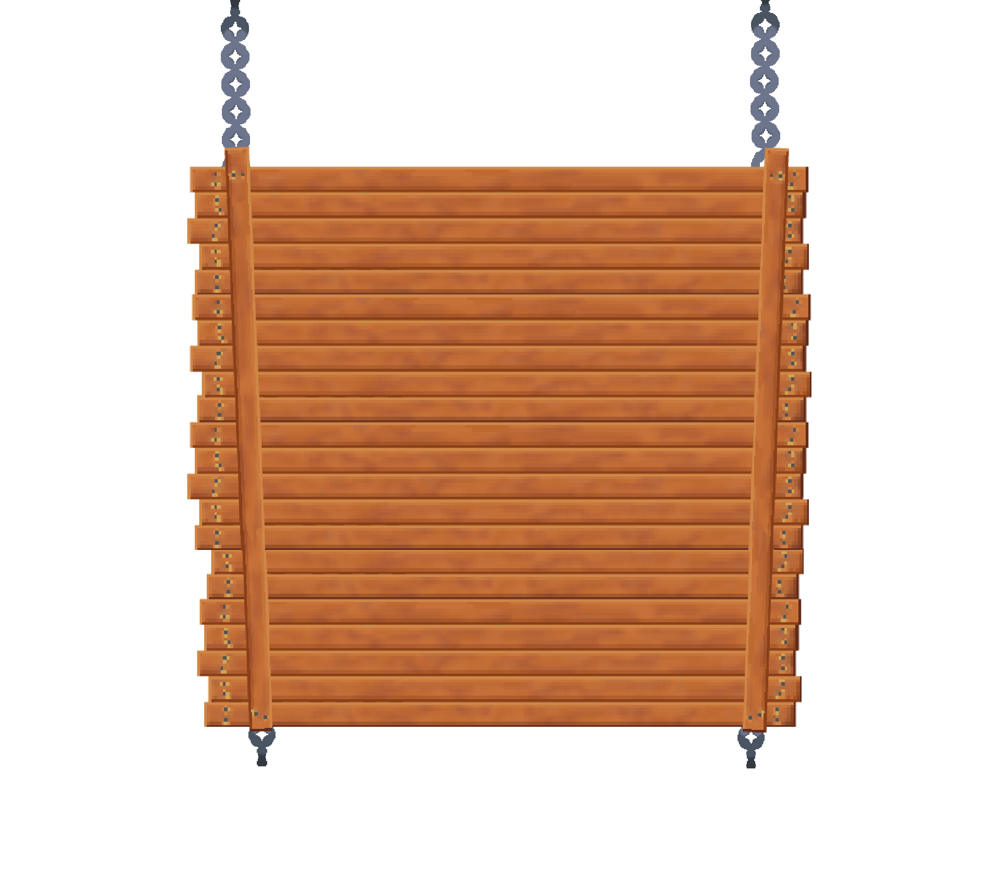

# 🏴‍☠️ Godot Pirate Game — 3D Naval Combat Template with Gerstner Waves

> **Category:** 3D Pirate / Godot 4 Ocean Physics  
> **Repository:** [zKlau/Godot-Pirate-Game](https://github.com/zKlau/Godot-Pirate-Game)  
> **Developer / Author:** `zKlau`  
> **License:** Open Source  
> **Stars:** Small account (2 stars)  
> **Engine:** Godot Engine 4 (GDScript, Boujie Water Shader)  

---

## 📸 In-Game Screenshots

| Volumetric Fog & Atmospheric Ocean Sailing | Broadside Naval Gameplay |
| :---: | :---: |
|  |  |

---

## 🌟 Project Overview
**Godot-Pirate-Game** is a comprehensive 3D pirate game template built in Godot 4. It integrates the acclaimed **Boujie Water Shader** for realistic Gerstner wave displacement with custom buoyancy probes that allow 3D ship models to pitch, roll, and heel realistically in stormy seas.

---

## 🎮 Key Features & Mechanics
- **Boujie Water Shader Integration:**
  - Real-time Gerstner wave displacement, subsurface scattering, foam peaks, and depth fog.
- **Rigid-Body Buoyancy Physics:**
  - 4-point floating probe script that applies upward buoyant impulses proportional to submerged depth.
- **Naval Combat & Island Exploration:**
  - Port/starboard cannon fire, health bars, sinking animations, and tropical islands to navigate around.

---

## 🛠️ Tech Stack & Architecture
- **Engine:** Godot 4.x.
- **Renderer:** Forward+ with Volumetric Fog.
- **Scripting:** GDScript.

---

## 📋 How to Clone & Run

```bash
git clone https://github.com/zKlau/Godot-Pirate-Game.git
```

Import into **Godot 4**, open `res://Scenes/World.tscn`, and press **F5**.
