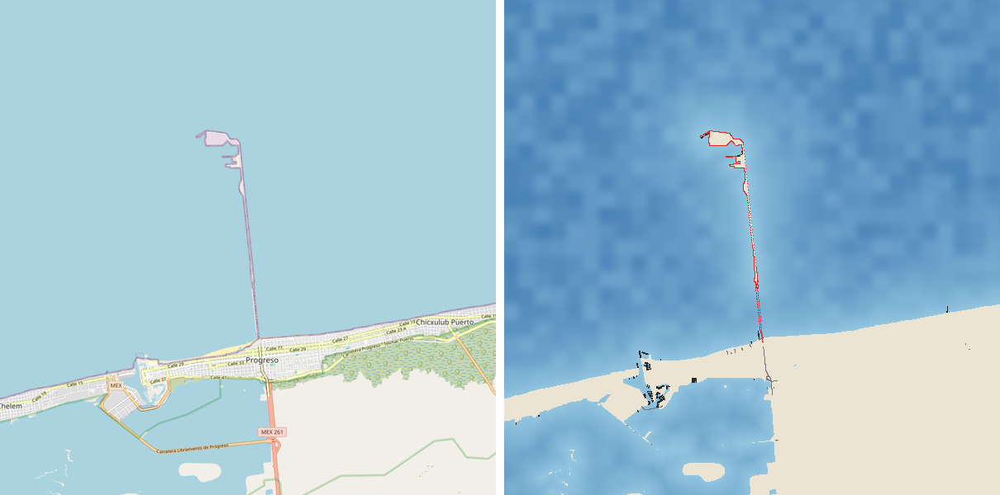
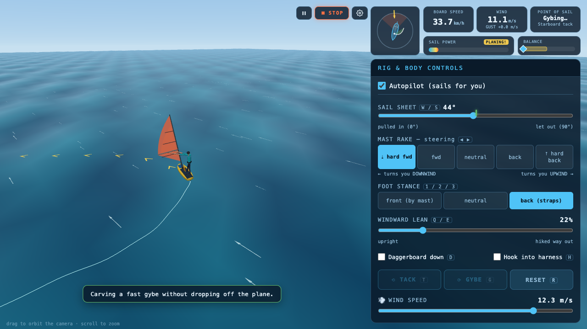

# ⛵ TrueWind & Windsurf Simulator — 3D Physics-First Sailing in the Browser

> **Category:** 3D Sailing / Aerodynamic Physics Simulation  
> **Repositories:** [hclivess/truewind](https://github.com/hclivess/truewind) & [viachm/windsurf-simulator](https://github.com/viachm/windsurf-simulator)  
> **Developers / Authors:** `hclivess` & `viachm`  
> **Licenses:** MIT License  
> **Stars:** Small accounts (2 stars & 4 stars)  
> **AI Assistance:** Windsurf Simulator built with **Claude AI** (`CLAUDE.md`)  
> **Tech Stack:** Three.js, TypeScript, Aerodynamic Foil Solvers  

---

## 📸 In-Game Screenshots

| TrueWind 3D Sailing Physics & Hull Hydrodynamics | 3D Windsurf Simulator Desktop View |
| :---: | :---: |
|  |  |

---

## 🌟 Project Overview
**TrueWind** and **Windsurf Simulator** are two premier open-source browser simulations that reject simplistic arcade steering in favor of **true aerodynamic and hydrodynamic physics equations**.

Built with Three.js, these simulators compute sail foil lift, drag polars, keel leeway resistance, apparent wind angles, and wave chop in real time.

---

## 🎮 Key Features & Mechanics
- **120Hz Fixed Physics Step:**
  - Decoupled aerodynamic simulation calculating sail lift-to-drag ratios based on angle of attack.
- **Apparent Wind & Sail Trimming:**
  - Realistic apparent wind calculation (true wind vector + boat velocity vector).
  - Sheet trimming, mast rake, and board planing physics at high speeds.
- **AI-Built Architecture:**
  - `viachm/windsurf-simulator` features a dedicated `CLAUDE.md` explaining how Claude was used to formulate the physics solver and Three.js camera rigs.

---

## 🛠️ Tech Stack & Architecture
- **Frontend:** Three.js + TypeScript + Vite.
- **Physics:** Custom numerical integration for lift/drag coefficients.

---

## 📋 How to Clone & Run

```bash
# TrueWind Sailing Simulator
git clone https://github.com/hclivess/truewind.git
cd truewind
npm install
npm run dev

# Or Windsurf Simulator
git clone https://github.com/viachm/windsurf-simulator.git
cd windsurf-simulator
npm install
npm run dev
```

Open `http://localhost:5173` to test live sailing and trim sheets.
