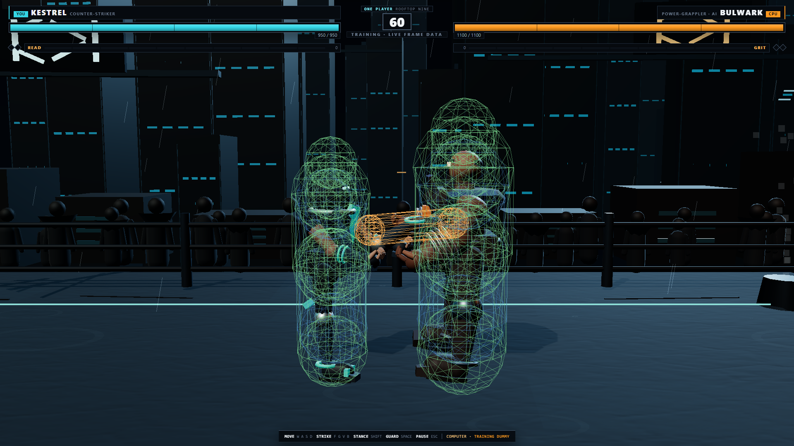
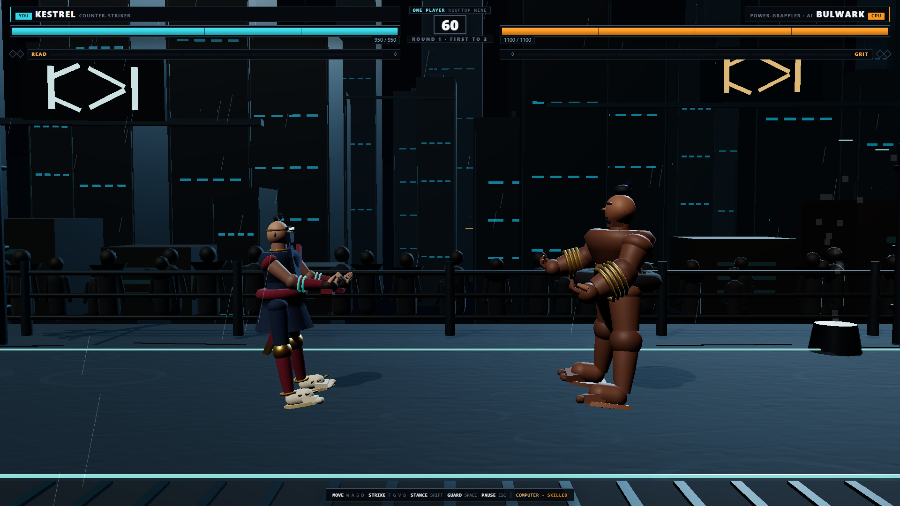

# 🥋 Claude of Iron — 120Hz 3D Fighting Game Built from 1 Continuation Prompt

> **Category:** 3D Fighting Game / Procedural Agentic Engineering  
> **Repository:** [usama-shiranai90/Claude-of-Iron](https://github.com/usama-shiranai90/Claude-of-Iron)  
> **Developer / Author:** Usama (`usama-shiranai90`)  
> **License:** MIT License  
> **Stars:** Small account (2 stars)  
> **AI Architecture:** **Single continuation prompt iteratively verified by Claude Code**  
> **Live Demo:** [usama-shiranai90.github.io/Claude-of-Iron/](https://usama-shiranai90.github.io/Claude-of-Iron/)  

---

## 📸 In-Game Screenshots

| Training Hitboxes & Hurtbox Swept Capsules | Neutral Spacing & Combat Stance Readability |
| :---: | :---: |
|  |  |

---

## 🌟 Project Overview
**Claude of Iron** is a browser-native 3D fighting game inspired by *Tekken* and *Virtua Fighter*. It features a **120Hz deterministic physics engine**, procedural character models and animations, swept-capsule hitboxes, and a reactive AI opponent that drives the same input pipeline as human players.

The entire project was generated from a **single continuation prompt** (`prompt.md`) iterated against strict automated regression test gates (`npm run verify`).

---

## 🎮 Key Features & Mechanics
- **Zero Art Assets (100% Procedural):**
  - Every mesh, texture, costume, rig, animation, and sound is synthesized from code at runtime.
  - 37 synthesized sound effects using the Web Audio API without a single MP3 or WAV file.
- **Combat Engine:**
  - 77 move IDs, 51 fighter states, 9 throws, swept-capsule pushboxes, and frame-accurate hit/hurt detection.
  - Headless combat runner that executes 82 deterministic unit tests in pure Node.js in seconds.
- **Subsystem Architecture:**
  - Decoupled `core`, `combat`, `physics`, `fighters`, `animation`, `ai`, `materials`, `world`, and `audio` systems.

---

## 🛠️ Tech Stack & Architecture
- **Engine:** Three.js + WebGL2.
- **Architecture:** Fixed 120Hz deterministic tick, render-interpolated clock.
- **Verification:** Bit-identical Chromium screenshot regression gate (`tools/imagediff.mjs`).

---

## 📋 How to Clone & Run

```bash
git clone https://github.com/usama-shiranai90/Claude-of-Iron.git
cd Claude-of-Iron
npm install
npm run dev
```

Open `http://localhost:5173`. Controls: `WASD` to move, `F`/`G` punch, `V`/`B` kick, `Space` guard.
