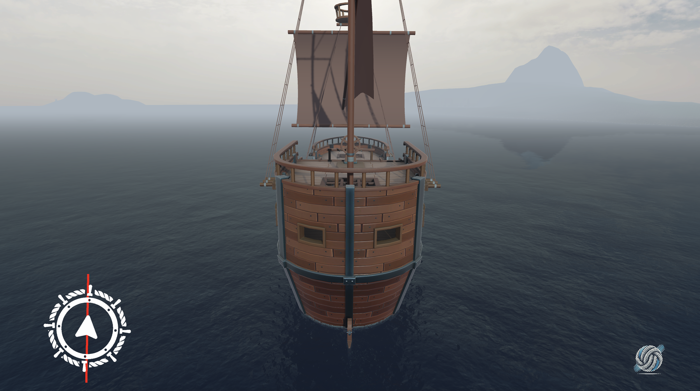
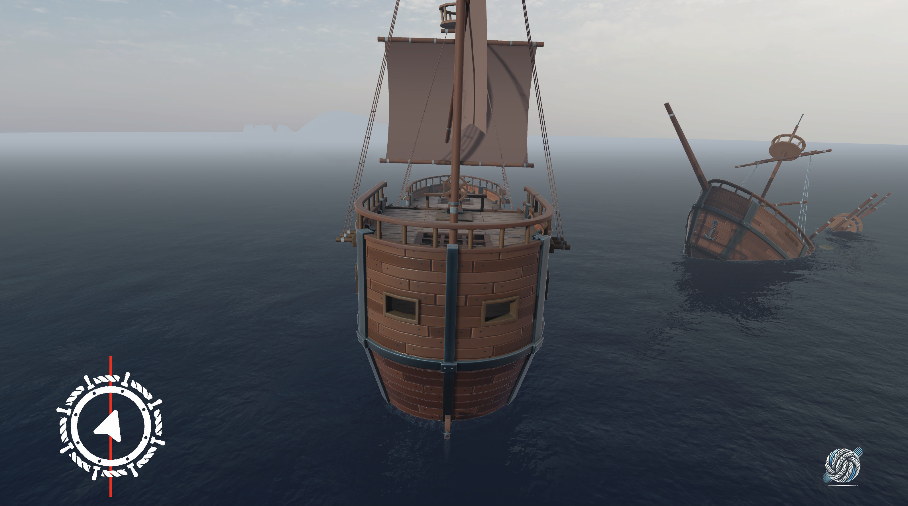

# ⚓ PCP Ship — 3D Pirate Ship Combat & Island Exploration in Unity

> **Category:** 3D Pirate / Naval RPG Prototype  
> **Repository:** [PCP-Software/pcp-ship](https://github.com/PCP-Software/pcp-ship)  
> **Developer / Team:** PCP Software  
> **License:** Open Source  
> **Stars:** Small account (0 stars)  
> **Engine:** Unity Engine (C#)  

---

## 📸 In-Game Screenshots

| Shipyard Harbor & Ocean Launch | Shipwreck Exploration & Island Reefs |
| :---: | :---: |
|  |  |

---

## 🌟 Project Overview
**PCP Ship** is an open-source 3D pirate game built in Unity exploring naval navigation, island harbors, shipwreck salvage, and tactical broadside combat. It provides a complete project template featuring rigged 3D galleons, water buoyancy, and island collision meshes.

---

## 🎮 Key Features & Mechanics
- **Interactive Ship Navigation:**
  - Smooth sailing controls with variable rudder angles and sail positions.
- **Island Archipelagos & Shipwreck Salvage:**
  - Explorable 3D tropical islands, coral reefs, and derelict shipwrecks to loot.
- **Cannon Combat:**
  - Port and starboard firing arcs with dynamic smoke particles and water splash effects.

---

## 🛠️ Tech Stack & Architecture
- **Engine:** Unity (URP).
- **Language:** C#.
- **Assets:** High-resolution 3D pirate vessels and island terrain props.

---

## 📋 How to Clone & Run

```bash
git clone https://github.com/PCP-Software/pcp-ship.git
```

Open in **Unity Hub**, launch `Assets/Scenes/Main.unity`, and press **Play**.
