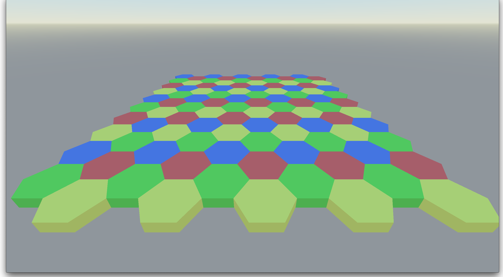

# 📐 Godot 3D Hex Grid & Goldberg Planet — Foundations for 3D Civ Games

> **Category:** 3D Civilization / Hex Math & Planetary Generation  
> **Repositories:** [josephmbustamante/Godot-3D-Hex-Grid-Tutorial](https://github.com/josephmbustamante/Godot-3D-Hex-Grid-Tutorial) & [DeanNevan/WanderingCivilization](https://github.com/DeanNevan/WanderingCivilization)  
> **Developers / Authors:** Joe Bustamante (`josephmbustamante`) & `DeanNevan`  
> **Licenses:** Open Source  
> **Stars:** Small accounts (22 stars & 2 stars)  
> **Engine:** Godot Engine 3.x / 4.x (GDScript)  

---

## 📸 In-Engine Screenshots

| 3D Hex Grid Math & Mouse Raycast Picking in Godot |
| :---: |
|  |

---

## 🌟 Project Overview
For any developer looking to build a 3D Civilization clone, these two repositories provide the essential mathematical and algorithmic building blocks:
1. **`Godot-3D-Hex-Grid-Tutorial`**: Demonstrates 3D hexagonal coordinate math (cube/axial to 3D Cartesian), procedural grid instantiation, and mouse raycast picking.
2. **`WanderingCivilization`**: Implements a true **3D spherical planet** using a Goldberg polyhedron (geodesic icosphere decomposed into 12 pentagons and hex tiles) for planetary 4X gameplay.

---

## 🎮 Key Features & Mechanics
- **3D Hexagonal Math:**
  - Precise axial coordinate math, neighbor lookups, and distance calculations.
  - Instancing 3D hexagonal prism meshes (`unit_hex.glb`) with custom color highlights.
- **Camera Raycast Picking:**
  - Projects screen mouse clicks into 3D world space to highlight and select clicked hex tiles.
- **Procedural Goldberg Spherical Planet:**
  - Generates seamless 3D spherical planets covered in hex tiles with food, production, and science yield indicators.

---

## 🛠️ Tech Stack & Architecture
- **Engine:** Godot 3.x and Godot 4.x.
- **Scripting:** GDScript.
- **Math:** Goldberg Polyhedron algorithms, Geodesic Icosphere subdividers.

---

## 📋 How to Clone & Run

```bash
# Hex Grid Tutorial
git clone https://github.com/josephmbustamante/Godot-3D-Hex-Grid-Tutorial.git
# Open in Godot and run res://Main.tscn

# Goldberg Planet Civilization
git clone https://github.com/DeanNevan/WanderingCivilization.git
# Open in Godot 4.2+ and run res://Test/Test.tscn
```
