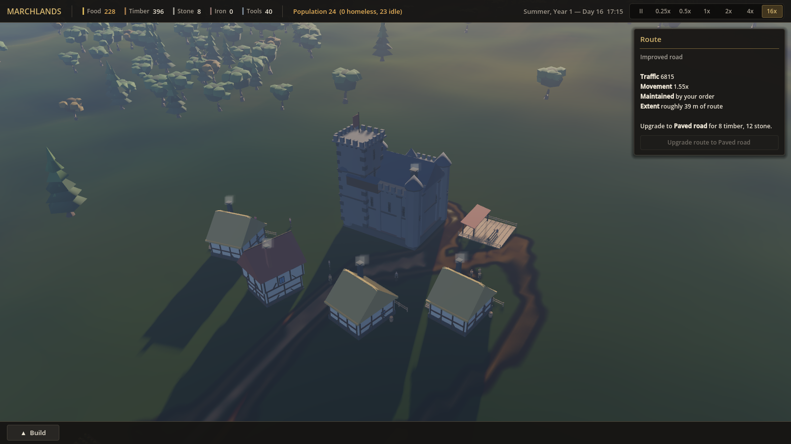
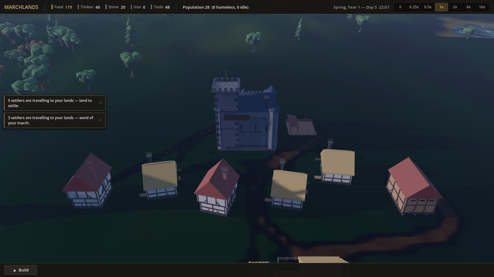

# 🏰 Marchlands — Organic Medieval Village with Living Desire Paths

> **Category:** 🌸 Cozy & Village / Everdale-Style Settlement  
> **Repository:** [tbosier/marchlands](https://github.com/tbosier/marchlands)  
> **Developer / Author:** `tbosier`  
> **License:** Open Source / MIT  
> **Stars:** Small account (1 star)  
> **Engine:** Godot Engine 4 (GDScript, GL Compatibility)  

---

## 📸 In-Game Screenshots

| Organic Village Footpaths Formed by Citizens | Warm Night-Time Village Illumination |
| :---: | :---: |
|  |  |

---

## 🌟 Project Overview
**Marchlands** is a cozy, organic medieval settlement simulation built in Godot 4. What sets this project apart is its revolutionary approach to road construction: **The player never draws roads manually.** Instead, the citizens (farmers, woodcutters, millers, and haulers) dynamically walk paths into existence.

Inspired by *Tiny Glade* and *Townscaper*, the village features clean flat-shaded low-poly buildings, pastel green knolls, stone wells, and warm lamplight that organically contour to the rolling terrain.

---

## 🎮 Key Features & Mechanics
- **Dynamic "Wear Field" Desire Paths:**
  - A dynamic texture map tracks citizen footsteps across terrain. Over time, high-traffic routes organically wear down grass into trodden dirt footpaths and cart roads.
- **Living Economic Simulation:**
  - Granular citizen daily routines: wake up, fetch water from wells, work shifts in crop fields or timber mills, deliver goods to storage barns, and return home.
- **Analytical Pathfinding:**
  - Integrates `AStarGrid2D` string-pulled pathfinding with dynamic road-weight feedback, encouraging citizens to naturally prefer existing worn trails.
- **Cozy Visual Atmosphere:**
  - Directional Godot 4 sunlight casting soft, long shadows across timber-framed roofs and wheat fields, transitioning into a warm nocturnal village glow.

---

## 🛠️ Tech Stack & Architecture
- **Engine:** Godot 4.2+ (Forward+ / GL Compatibility).
- **Scripting:** GDScript 2.0 with decoupled system nodes.
- **Terrain:** Custom heightmap mesh with multi-pass wear shader.

---

## 📋 How to Clone & Run

```bash
git clone https://github.com/tbosier/marchlands.git
```

1. Launch **Godot Engine 4.2+**.
2. Click **Import**, navigate to `marchlands/game/project.godot`.
3. Press **F5** to start the village simulation.
