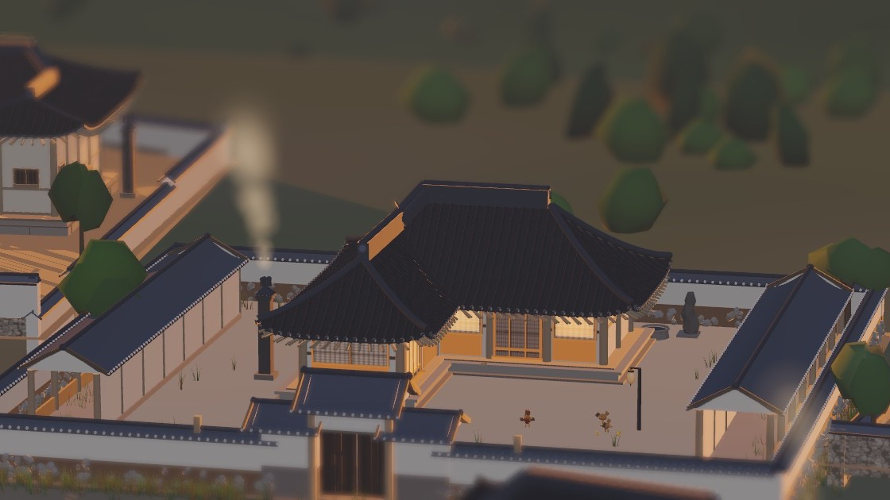

# 🏯 Cheoma — 3D Procedural Joseon Village & Walking Sandbox in Three.js

> **Category:** 🌸 Cozy & Village / Painterly Ghibli Aesthetics  
> **Repository:** [midagedev/cheoma](https://github.com/midagedev/cheoma)  
> **Developer / Author:** `midagedev`  
> **License:** MIT License  
> **Stars:** Small account (1 star)  
> **Tech Stack:** Three.js (0.185.1) + Svelte 5 / Vite  

---

## 📸 In-Game Screenshots

| Panoramic Mountain Village View | Traditional Korean House Detail |
| :---: | :---: |
|  |  |

---

## 🌟 Project Overview
**Cheoma** is a breathtaking 3D procedural village generator and walkable sandbox built with Three.js. It procedurally synthesizes historical Korean Joseon-era settlements — from solitary countryside cottages nestled beside mountain streams to sprawling walled administrative capitals — all from a single random seed.

Its visual presentation evokes Studio Ghibli watercolors, utilizing custom material Fresnel rim-lighting, cinematic bokeh depth-of-field, and golden hour sun angles.

---

## 🎮 Key Features & Mechanics
- **Procedural Settlement Synthesis:**
  - Hierarchical generative rules place traditional tiled-roof pavilions (*giwa*), thatched peasant cottages (*choga*), earthen walls, courtyards, and terraced rice paddies.
- **Multiple Exploration Modes:**
  - First-person ground walking controller with collision detection, cinematic drone fly-through, and orbital camera.
- **Cinematic Three.js Post-Processing:**
  - Integrated ACES tone mapping, bloom, and depth-of-field blur.
- **Export Capabilities:**
  - One-click export of the generated village to `.glb` 3D files, collision meshes, and heightfield grids.

---

## 🛠️ Tech Stack & Architecture
- **Rendering:** Three.js 0.185 + WebGL.
- **Framework:** Svelte 5 + Vite.
- **Language:** TypeScript.

---

## 📋 How to Clone & Run

```bash
git clone https://github.com/midagedev/cheoma.git
cd cheoma/app
npm install
npm run dev
```

Open `http://localhost:5173` in your browser.
