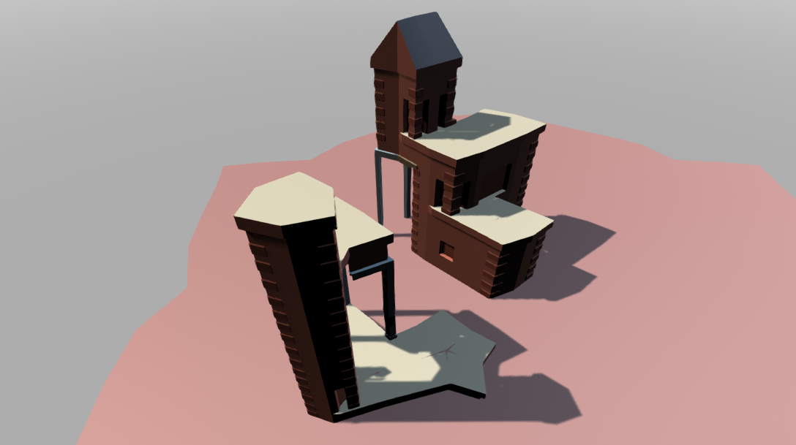
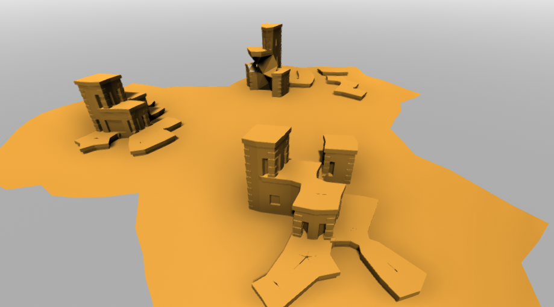

# 🏘️ TownBuilder — Oskar Stålberg's Townscaper Reproduction in Unity

> **Category:** 🌸 Cozy & Village / Procedural Mesh Generation  
> **Repository:** [eliemichel/TownBuilder](https://github.com/eliemichel/TownBuilder)  
> **Developer / Author:** Élie Michel (`eliemichel`)  
> **License:** MIT License  
> **Stars:** Small account (32 stars)  
> **Engine:** Unity Engine (C#, BMeshUnity)  

---

## 📸 In-Game Screenshots

| Townscaper Seaside Town Reproduction | Module-Based Marching Cubes WFC Grid |
| :---: | :---: |
|  |  |

---

## 🌟 Project Overview
**TownBuilder** is an open-source technical recreation of Oskar Stålberg's indie hit *Townscaper* inside Unity. It demonstrates the exact procedural generation principles that make *Townscaper* so magical: clicking on the ocean effortlessly spawns vibrant pastel houses, cobblestone quays, archways, and rooftops.

---

## 🎮 Key Features & Mechanics
- **Module-Based Marching Cubes & WFC:**
  - Evaluates dual-grid cell occupancy and automatically matches boundary configurations to resolve corner pieces, archways, balconies, and roofs.
- **Dynamic BMesh Runtime Generation:**
  - Uses `BMeshUnity` (a Blender BMesh port to C#) to stitch, bevel, and weld 3D geometry dynamically in real time without lag.
- **Vibrant Pastel Palette:**
  - Colorful terracotta, white stucco, turquoise shutters, and cobblestone quays.

---

## 🛠️ Tech Stack & Architecture
- **Engine:** Unity 2020.3 LTS+.
- **Language:** C#.
- **Mesh Library:** BMeshUnity.

---

## 📋 How to Clone & Run

```bash
git clone https://github.com/eliemichel/TownBuilder.git
```

Open the project in **Unity Hub**, open `Assets/Scenes/SampleScene.unity`, and press **Play** to start building seaside towns.
