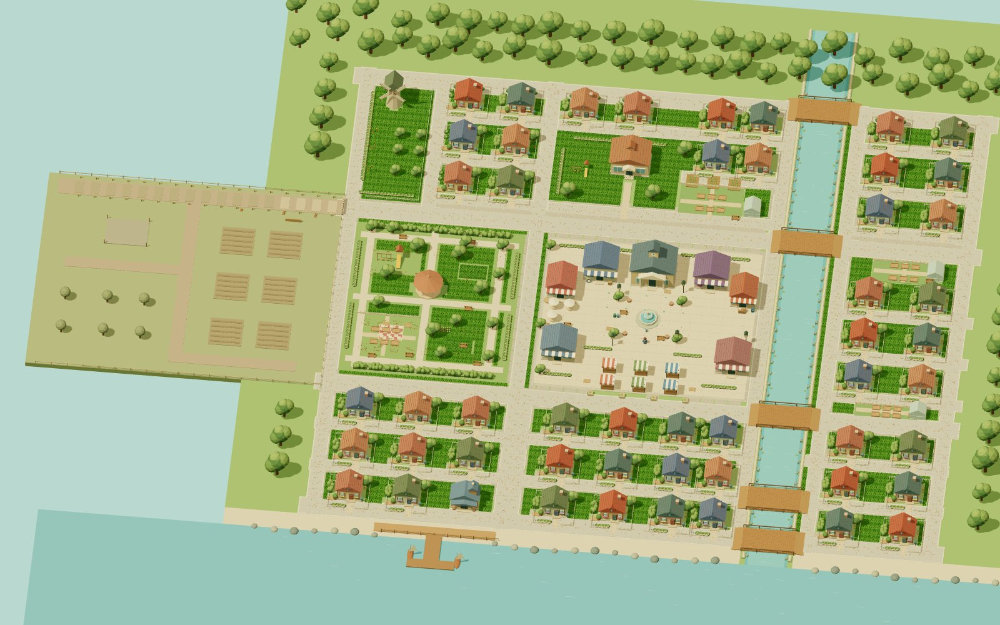

# 🏡 Townies — Animal Crossing Meets Cooperative Civic Town Life

> **Category:** 🌸 Cozy & Village / Multiplayer Life Sim  
> **Repository:** [Brayden/townies](https://github.com/Brayden/townies)  
> **Developer / Author:** Brayden Wilmoth (`Brayden`)  
> **License:** Apache-2.0  
> **Stars:** Small account (53 stars)  
> **Tech Stack:** Three.js, React, Vite, WebSockets  

---

## 📸 In-Game Screenshots

| Cozy Town Welcome & Suburban Neighborhood View |
| :---: |
|  |

---

## 🌟 Project Overview
**Townies** is a multiplayer cozy life simulator running in modern web browsers that fuses the idyllic charm of *Animal Crossing* with cooperative civic town management. Up to 50 players live together in a shared suburban town, purchasing plots, decorating houses, riding bicycles, and contributing to the municipal treasury.

---

## 🎮 Key Features & Mechanics
- **9 Physical Mini-Jobs:**
  - Mowing lawns, planting flower beds, newspaper delivery cycling, street cleaning, powerwashing sidewalks, and hedge trimming.
- **50 Customizable House Plots:**
  - Purchase real estate, design exterior facades, and decorate cozy interiors.
- **Democratic Civic System:**
  - Run for mayor, vote in weekly municipal elections, set tax rates, and finance public works (parks, fountains, bike paths).
- **Multiplayer Networking:**
  - Real-time synchronization of player avatars, bicycles, chat, and pets.

---

## 🛠️ Tech Stack & Architecture
- **Rendering:** Three.js + React.
- **State & Networking:** Node.js WebSocket backend.
- **Language:** TypeScript.

---

## 📋 How to Clone & Run

```bash
git clone https://github.com/Brayden/townies.git
cd townies
npm ci
npm run setup
npm run dev
```

Open `http://localhost:3002` in your browser.
