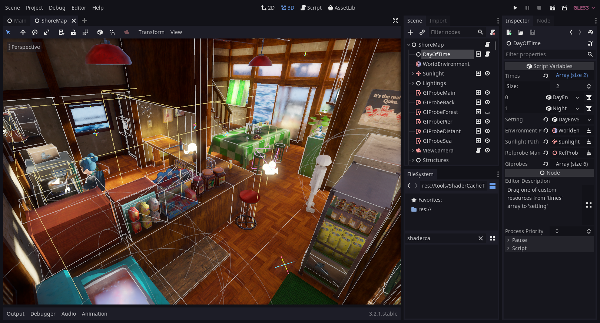
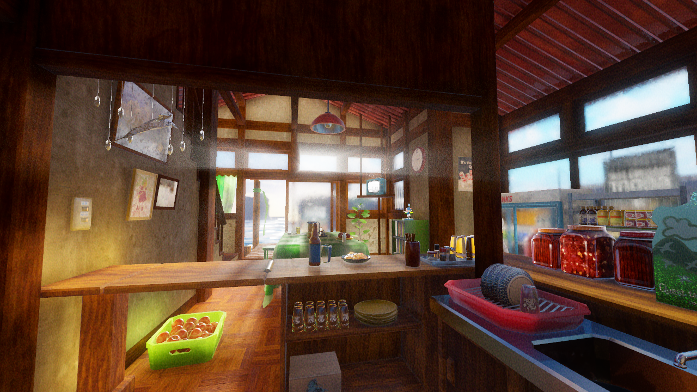

# 🍉 Project Summer Island — Nostalgic Japanese Rural Seaside Exploration

> **Category:** 🌸 Cozy & Village / Nostalgic Seaside Sim  
> **Repository:** [sunkper/Project-Summer-Island](https://github.com/sunkper/Project-Summer-Island)  
> **Developer / Author:** `sunkper`  
> **License:** Open Source  
> **Stars:** Small account (89 stars)  
> **Engine:** Godot Engine 3.x / 4.x (GDScript)  

---

## 📸 In-Game Screenshots

| Japanese Seaside Home & Harbor View | Traditional Tatami & Kitchen Interior |
| :---: | :---: |
|  |  |

---

## 🌟 Project Overview
Inspired by *Boku no Natsuyasumi* (My Summer Vacation) and *Animal Crossing*, **Project Summer Island** recreates the nostalgic feeling of spending a carefree summer holiday in a peaceful Japanese coastal hamlet.

Players wander freely through a fully modeled traditional seaside house featuring tatami mat rooms, sliding shoji paper doors, coastal gardens, cicada soundscapes, and panoramic ocean views.

---

## 🎮 Key Features & Mechanics
- **Authentic Japanese Architecture:**
  - Highly detailed 3D assets for engawa verandas, shoji screens, tatami mats, and seaside piers.
- **Atmospheric Sensory Design:**
  - Gentle summer breezes, cicada hum, lapping ocean waves, and golden afternoon sunbeams.
- **Exploration Controller:**
  - Smooth third-person and fixed-camera vantage points reminiscent of classic adventure titles.

---

## 🛠️ Tech Stack & Architecture
- **Engine:** Godot Engine.
- **Scripting:** GDScript.
- **Asset Pipeline:** Blender models optimized for real-time mobile and desktop rendering.

---

## 📋 How to Clone & Run

```bash
git clone https://github.com/sunkper/Project-Summer-Island.git
```

Open the project in **Godot Engine** and press **F5** to explore the summer island.
