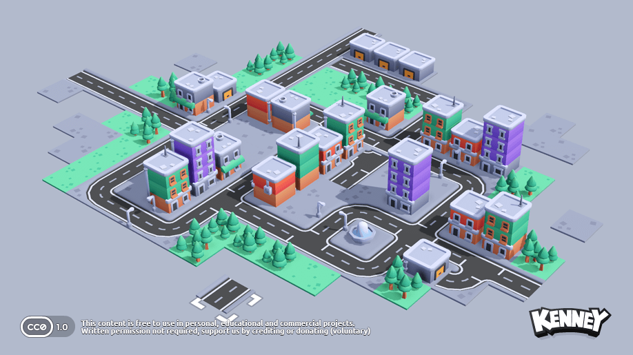

# 🍃 EcoCity — Low-Poly Clean Energy Town Builder in Godot 4

> **Category:** 🌸 Cozy & Village / Low-Poly Eco Sim  
> **Repository:** [lemilonkh/EcoCity](https://github.com/lemilonkh/EcoCity)  
> **Developer / Author:** `lemilonkh`  
> **License:** MIT License (CC0 Assets)  
> **Stars:** Small account (3 stars)  
> **Engine:** Godot 4.2+ (GDScript)  

---

## 📸 In-Game Screenshots

| Clean Energy Low-Poly Village with Wind Turbines & Solar Arrays |
| :---: |
|  |

---

## 🌟 Project Overview
**EcoCity** is a vibrant, relaxing low-poly town builder built with Godot 4. Utilizing Kenney's celebrated CC0 3D assets, players construct charming sustainable villages powered by wind turbines, solar panels, and organic farms.

---

## 🎮 Key Features & Mechanics
- **Clean Energy Balancing:**
  - Balance grid energy demands between solar parks, wind hills, and residential housing.
- **Grid Placement & MeshLibrary:**
  - Clean Godot 4 `GridMap` 3D placement with hover previews and cost deductions.
- **Cozy Toy-Box Aesthetics:**
  - Pastel green meadows, winding rivers, animated spinning wind turbine blades, and soft shadows.

---

## 🛠️ Tech Stack & Architecture
- **Engine:** Godot 4.2+.
- **Language:** GDScript.
- **Models:** Kenney 3D CC0 Kits.

---

## 📋 How to Clone & Run

```bash
git clone https://github.com/lemilonkh/EcoCity.git
```

Import `project.godot` into **Godot 4.2+** and press **F5**.
