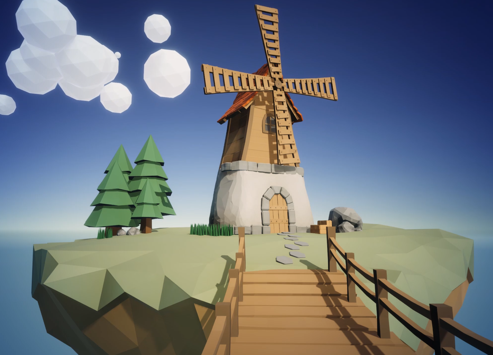

# ☁️ Unity Flying Island — Floating Windmill Diorama with Stylized Shaders

> **Category:** 🌸 Cozy & Village / Floating Island Diorama  
> **Repository:** [barnabasbartha/Unity-Flying-Island](https://github.com/barnabasbartha/Unity-Flying-Island)  
> **Developer / Author:** Barnabas Bartha (`barnabasbartha`)  
> **License:** MIT License  
> **Stars:** Small account (3 stars)  
> **Engine:** Unity (Universal Render Pipeline - URP)  

---

## 📸 In-Game Screenshots

| Floating Windmill Island Diorama with Swaying Foliage |
| :---: |
|  |

---

## 🌟 Project Overview
**Unity Flying Island** is a peaceful, floating island diorama built in Unity URP. It features a cozy medieval windmill perched atop an earthen floating rock island surrounded by swaying pine trees, fluffy drifting clouds, and fluttering butterflies.

---

## 🎮 Key Features & Mechanics
- **Custom Wind Shader:**
  - Procedural vertex displacement simulating gentle wind gusts rustling grass blades and pine needles.
- **Mechanical Windmill Animation:**
  - Physics-driven windmill rotor with mechanical gear creaks.
- **Stylized URP Lighting:**
  - Warm directional sunlight, soft ambient occlusion, and cartoon cloud shadows.

---

## 🛠️ Tech Stack & Architecture
- **Engine:** Unity (URP).
- **Language:** C#.
- **Shaders:** Shader Graph custom stylized foliage shaders.

---

## 📋 How to Clone & Run

```bash
git clone https://github.com/barnabasbartha/Unity-Flying-Island.git
```

Open in **Unity Hub** (URP project) and press **Play** in `Assets/Scenes/SampleScene.unity`.
