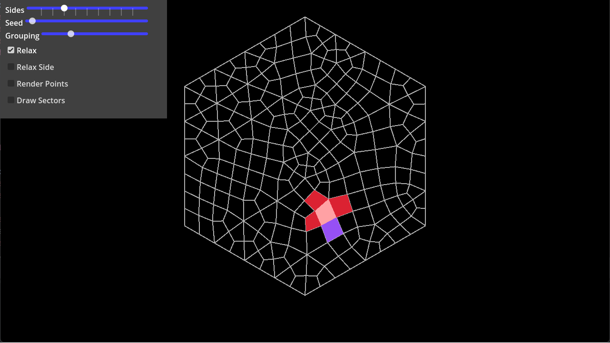
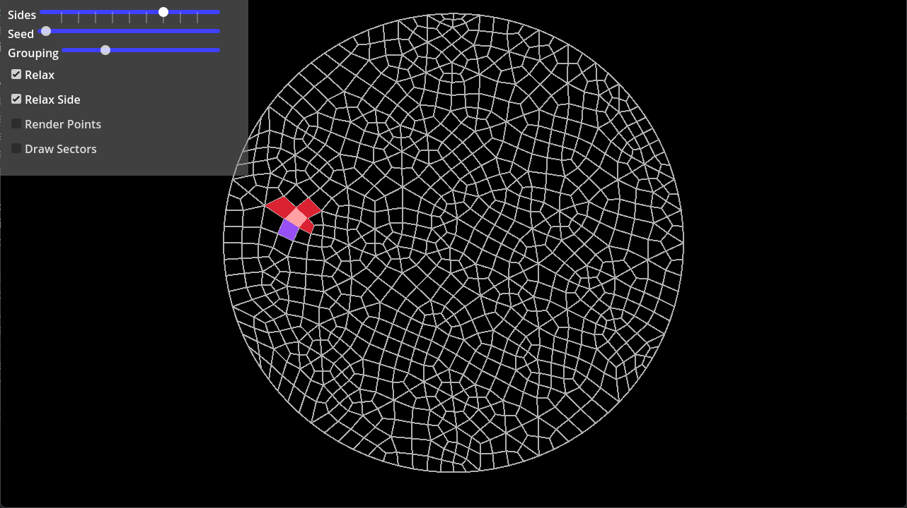

# 📐 Hexagrid-Relaxed — Townscaper Organic Mesh Grid Generator in Godot 4

> **Category:** 🌸 Cozy & Village / Procedural Townscaper Math  
> **Repository:** [megowan/hexagrid-relaxed](https://github.com/megowan/hexagrid-relaxed)  
> **Developer / Author:** `megowan`  
> **License:** CC0 1.0 Universal  
> **Stars:** Small account (27 stars)  
> **Engine:** Godot 4.3 (GDScript)  

---

## 📸 In-Engine Screenshots

| Organic Relaxed Grid for Townscaper Towns | Boundary Edge Smoothing |
| :---: | :---: |
|  |  |

---

## 🌟 Project Overview
**Hexagrid-Relaxed** is a Godot 4 implementation of Oskar Stålberg's irregular mesh grid algorithm—the mathematical foundation powering *Townscaper*. It generates non-orthogonal, organically curving quad and triangle grids that give stylized villages their quaint, curved streets and natural harbor quays.

---

## 🎮 Key Features & Mechanics
- **Laplacian Relaxation Loop:**
  - Subdivides hexagonal tiles, merges triangles, and applies iterative vertex relaxation to yield soft, curving architectural plots.
- **Dual-Grid Construction:**
  - Automatically computes Voronoi duals for placement of street corners, towers, and courtyards.
- **CC0 Public Domain:**
  - Completely unrestricted for use in commercial or open-source cozy town builders.

---

## 🛠️ Tech Stack & Architecture
- **Engine:** Godot 4.3.
- **Scripting:** Pure GDScript with optimized Vector2/Vector3 math arrays.

---

## 📋 How to Clone & Run

```bash
git clone https://github.com/megowan/hexagrid-relaxed.git
```

Open in **Godot 4.3** and run the main test scene (`F5`).
