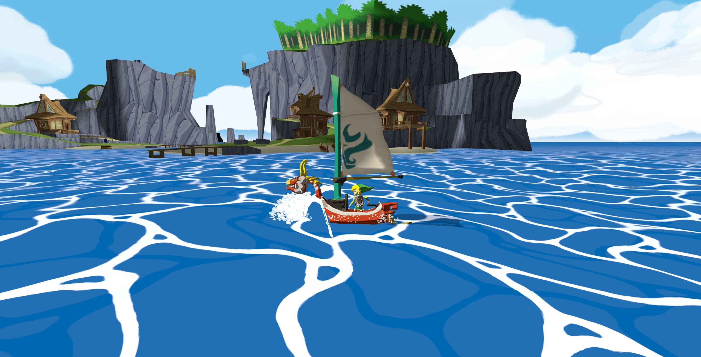

# 🌊 Zelda Wind Waker Great Sea — Three.js Toon Ocean & Sailing Simulator

> **Category:** 🗡️ Stylized Adventure / Zelda Cel-Shading  
> **Repository:** [Robpayot/zelda-project-public](https://github.com/Robpayot/zelda-project-public)  
> **Developer / Author:** Robin Payot (`Robpayot`)  
> **License:** Open Source  
> **Stars:** 192 stars  
> **Tech Stack:** Three.js + GLSL + Vite  

---

## 📸 In-Game Screenshots

| The Great Sea Toon Shading & Red Lions Sailing |
| :---: |
|  |

---

## 🌟 Project Overview
**Zelda Wind Waker Project** is a faithful web reproduction of Nintendo's GameCube classic *The Legend of Zelda: The Wind Waker*. Built directly with Three.js and custom GLSL shaders, players steer the *King of Red Lions* sailing boat across a vibrant cel-shaded Great Sea featuring stepped wave displacements, cartoon foam rings, procedural wind currents, and explorable tropical islands.

---

## 🎮 Key Features & Mechanics
- **Custom Wind Waker Water Shader:**
  - Stepped vertex displacement and cartoon light bands matching Nintendo's original art style.
- **Dynamic Sailing Physics:**
  - Wind compass vector calculation, sail angle trimming, and buoyant hull pitch/roll.
- **Island Archipelagos & Seagulls:**
  - Explorable 3D low-poly islands, watchtowers, and flocking seagull AI.

---

## 🛠️ Tech Stack & Architecture
- **Graphics:** Three.js + WebGL + GLSL shaders.
- **Bundler:** Vite.
- **Language:** JavaScript.

---

## 📋 How to Clone & Run

```bash
git clone https://github.com/Robpayot/zelda-project-public.git
cd zelda-project-public
npm install
npm run dev
```

Open `http://localhost:5173` in your browser.
