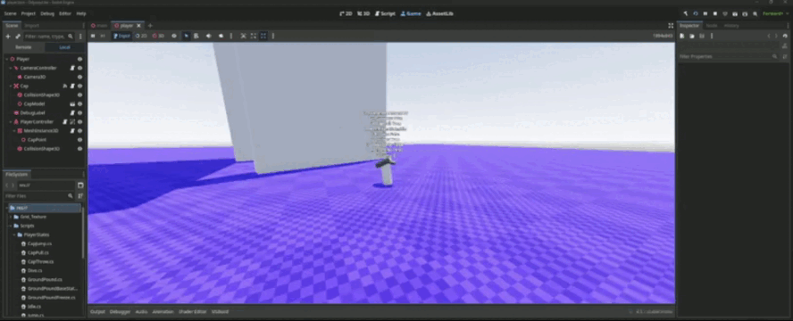

# 🧢 OdysseyLike — Super Mario Odyssey Cappy & Acrobatic Controller in Godot 4

> **Category:** 🗡️ Stylized Adventure / 3D Cartoon Platformer  
> **Repository:** [kruumy/OdysseyLike](https://github.com/kruumy/OdysseyLike)  
> **Developer / Author:** `kruumy`  
> **License:** Open Source  
> **Stars:** Small account (4 stars)  
> **Engine:** Godot 4.x (.NET / C#)  

---

## 📸 In-Game Screenshots

| Cappy Throw, Mid-Air Dive & Wall Kick Acrobatics |
| :---: |
|  |

---

## 🌟 Project Overview
**OdysseyLike** is a high-fidelity recreation of the acrobatic movement physics from *Super Mario Odyssey* built in Godot 4. It implements Mario's iconic companion cap mechanics, allowing players to throw Cappy, perform mid-air cap bounces, ground pound cancel into horizontal dives, and chain momentum-preserving wall kicks.

---

## 🎮 Key Features & Mechanics
- **Cappy State Machine:**
  - `CapThrow`, `CapHold`, `CapJump` (jump trampoline off cap in mid-air), and `CapPull`.
- **Acrobatic Momentum Chaining:**
  - Ground pound freeze frame, horizontal forward dive, roll boosting, and wall sliding.
- **Banking Velocity Camera:**
  - Dynamic 3D platforming camera that tilts and pans to maintain character readability.

---

## 🛠️ Tech Stack & Architecture
- **Engine:** Godot 4.x (.NET Edition).
- **Language:** C# (.NET 8.0).
- **Physics:** Godot 3D Kinematic Character Controller.

---

## 📋 How to Clone & Run

```bash
git clone https://github.com/kruumy/OdysseyLike.git
```

Open in **Godot 4 (.NET)**, build C# solution (`dotnet build`), and press **F5**.
