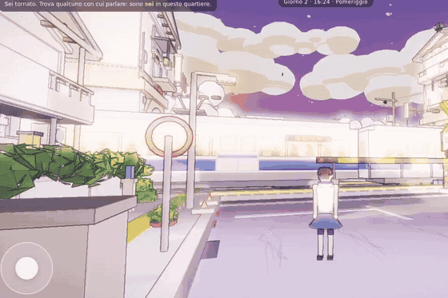

# 🌸 3D Sakura Crossing — Ghibli Anime Seaside Town in Single-File Three.js

> **Category:** 🗡️ Stylized Adventure / Anime Cel-Shading  
> **Repository:** [danymaniglie-cmyk/3d-sakura-crossing](https://github.com/danymaniglie-cmyk/3d-sakura-crossing)  
> **Developer / Author:** Dany Maniglie (`danymaniglie-cmyk`)  
> **License:** Open Source  
> **Stars:** Small account (4 stars)  
> **Tech Stack:** Three.js (r128), Zero-Build HTML5 (800 KB total)  

---

## 📸 In-Game Screenshots

| Studio Ghibli Seaside Town, Railway Crossing & Kei Car |
| :---: |
|  |

---

## 🌟 Project Overview
**3D Sakura Crossing** is a miniature Studio Ghibli inspired Japanese seaside town running in a single self-contained HTML file without any build step. At sunset, cherry blossoms drift past traditional residences, lifting bascule bridges, and functioning railway level crossings with ringing bells and passing trains.

---

## 🎮 Key Features & Mechanics
- **Versatile Character Controller:**
  - Walk, sprint, jump, climb curbs, slide down walls, swim, and dive in the sea.
- **Drivable Japanese Kei Car:**
  - Hop into a cute yellow micro-truck with functional wheel steering and acceleration physics.
- **Anime Post-Processing:**
  - 3-band toon ramp lighting `[76, 150, 255]` paired with a Roberts cross screen-space ink line art pass.
- **Zero Dependencies:**
  - Entire experience is packaged into a single lightweight 800 KB file.

---

## 🛠️ Tech Stack & Architecture
- **Engine:** Three.js r128.
- **Architecture:** Zero-build vanilla ES modules in one HTML file.

---

## 📋 How to Clone & Run

```bash
git clone https://github.com/danymaniglie-cmyk/3d-sakura-crossing.git
# Simply double click index.html or open with any browser!
```
