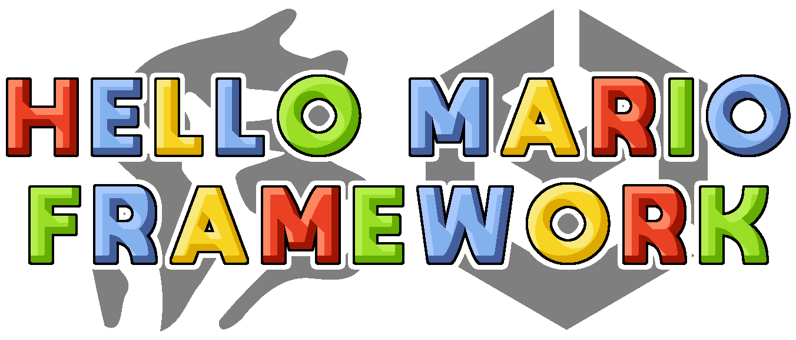

# 🍄 Hello Mario Framework — Complete 3D Mario Platformer Engine in Unity

> **Category:** 🗡️ Stylized Adventure / 3D Platformer Engine  
> **Repository:** [HelloFangaming/HelloMarioFramework](https://github.com/HelloFangaming/HelloMarioFramework)  
> **Developer / Team:** Hello Fangaming  
> **License:** Open Source  
> **Stars:** Small account (90 stars)  
> **Engine:** Unity 2022.3 LTS (C#)  

---

## 📸 In-Game Screenshots

| Hello Mario Framework 3D Platforming Core |
| :---: |
|  |

---

## 🌟 Project Overview
**Hello Mario Framework** is an expansive open-source 3D platformer game foundation built in Unity that implements the complete move-set of 3D Mario titles (*Mario 64, Sunshine, Galaxy, 3D World*).

It features responsive acrobatic physics, enemy AI (Goombas, Koopas), moving platforms, coin collection, power-ups, and in-editor level construction tools.

---

## 🎮 Key Features & Mechanics
- **Full Acrobatic Moveset:**
  - Triple jumps with escalating height, mid-air body dive, rolls, crouch slide, ground pound, and swimming.
- **Classic Enemy AI:**
  - Stompable Goombas, shell-kicking Koopas, and patrol routes.
- **RealtimeCSG Integration:**
  - Build and playtest complete 3D platformer levels directly inside the Unity Editor without 3D modeling software.

---

## 🛠️ Tech Stack & Architecture
- **Engine:** Unity 2022.3 LTS.
- **Language:** C#.
- **Level Design:** RealtimeCSG procedural geometry.

---

## 📋 How to Clone & Run

```bash
git clone https://github.com/HelloFangaming/HelloMarioFramework.git
```

Open the project in **Unity Hub** and play the demo scene in `Assets/HelloMarioFramework/Scenes/`.
