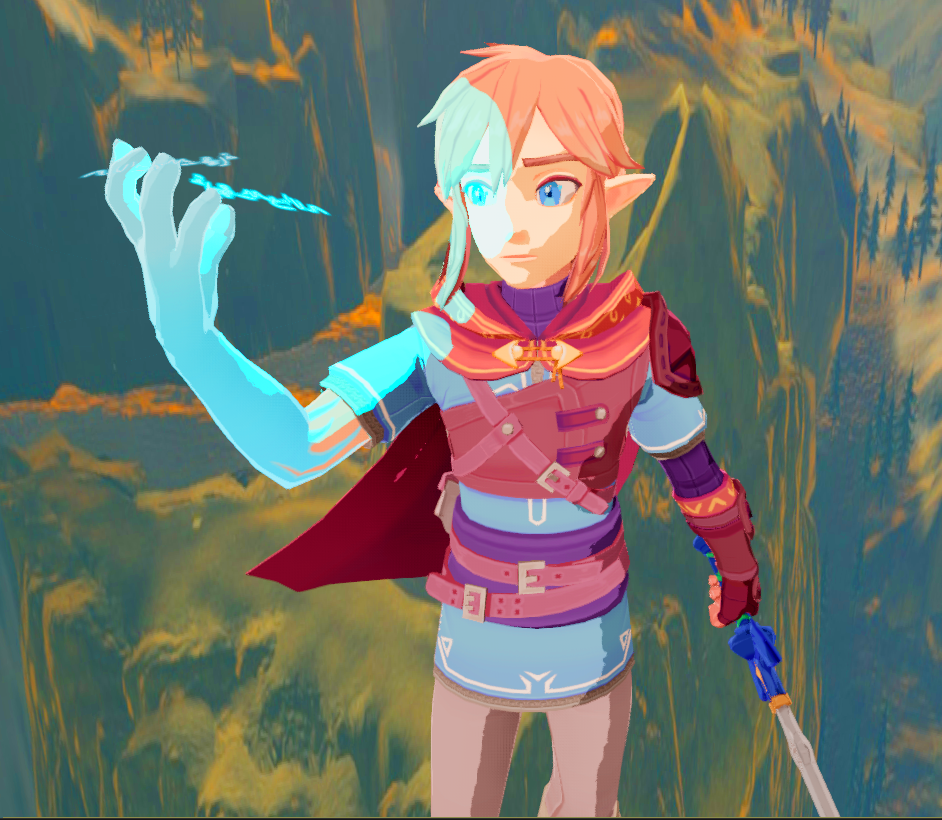

# 🗡️ Godot BotW Toon Shader — Authentic Breath of the Wild Shading

> **Category:** 🗡️ Stylized Adventure / Zelda Art Direction  
> **Repository:** [nekotogd/Godot_BoTW_Toon_Shader](https://github.com/nekotogd/Godot_BoTW_Toon_Shader)  
> **Developer / Author:** `nekotogd`  
> **License:** CC0 1.0 Universal (Public Domain)  
> **Stars:** 165 stars  
> **Engine:** Godot Engine 3.x / 4.x (GDShader)  

---

## 📸 In-Engine Screenshots

| Authentic Zelda: Breath of the Wild Toon Shading in Godot |
| :---: |
|  |

---

## 🌟 Project Overview
**Godot_BoTW_Toon_Shader** is a meticulous public-domain reproduction of Nintendo's visual shading pipeline from *The Legend of Zelda: Breath of the Wild* implemented in Godot.

It replicates the hand-painted, soft anime aesthetic through subtle shadow warble, anisotropic hair sheen, side-shine rimlighting, and multi-light support.

---

## 🎮 Key Features & Mechanics
- **Hand-Animated Shadow Warble:**
  - Subtle noise perturbation along shadow boundaries preventing rigid CGI edges.
- **Side Shines & Backlight Rims:**
  - Simulates subsurface light scattering across character silhouettes.
- **Anisotropic Hair Highlights:**
  - Ring-shaped specular highlights that shift naturally with camera perspective.

---

## 🛠️ Tech Stack & Architecture
- **Engine:** Godot Engine (Godot 3 & 4 versions available).
- **Language:** GDShader.
- **License:** CC0 Public Domain.

---

## 📋 How to Clone & Run

```bash
git clone https://github.com/nekotogd/Godot_BoTW_Toon_Shader.git
```

Open in **Godot**, switch to branch `demo_scene` if needed, and open `demo.tscn`.
