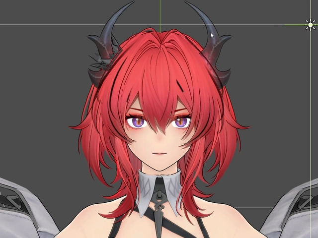
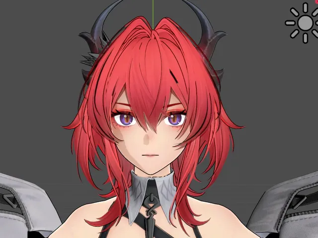

# ✨ Anime SDF Face & Outline Shader — Genshin / ArcSys Look in Godot 4

> **Category:** 🗡️ Stylized Adventure / Anime Shading  
> **Repository:** [albanogiovanni/godot-anime-sdf-shader](https://github.com/albanogiovanni/godot-anime-sdf-shader)  
> **Developer / Author:** Giovanni Albano (`albanogiovanni`)  
> **License:** MIT License  
> **Stars:** Small account (11 stars)  
> **Engine:** Godot 4.x (GDShader / VisualShader)  

---

## 📸 In-Engine Screenshots

| Signed Distance Field Facial Shadows | Inverted Hull Outline Shading |
| :---: | :---: |
|  |  |

---

## 🌟 Project Overview
In 3D anime games like *Genshin Impact* and *Guilty Gear -Strive-*, ordinary 3D lighting produces grotesque facial shadows on stylized characters. This project implements **Signed Distance Field (SDF) facial shading** in Godot 4, guaranteeing clean, artistically perfect facial shadows from every lighting angle.

---

## 🎮 Key Features & Mechanics
- **SDF Light-Direction UV Flipping:**
  - Smoothly interpolates shadow masks between front and side lighting without ugly polygon creases.
- **Inverted Hull Outlines:**
  - Vertex extrusion outline pass with distance-adaptive scaling.
- **Flattened XZ Lighting:**
  - Prevents unnatural vertical lighting splits on character clothing.

---

## 🛠️ Tech Stack & Architecture
- **Engine:** Godot 4.x.
- **Shader:** GDShader / VisualShader.

---

## 📋 How to Clone & Run

```bash
git clone https://github.com/albanogiovanni/godot-anime-sdf-shader.git
```

Import into **Godot 4** and run `preview.tscn`.
