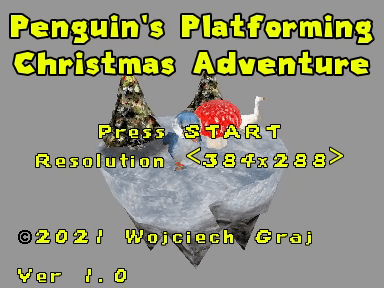

# 🐧 Penguin Platformer — Retro PS1 Cartoon Platformer with Belly Slides

> **Category:** 🗡️ Stylized Adventure / Retro Cartoon Platformer  
> **Repository:** [wojciech-graj/penguin-platformer](https://github.com/wojciech-graj/penguin-platformer)  
> **Developer / Author:** Wojciech Graj (`wojciech-graj`)  
> **License:** MIT License  
> **Stars:** Small account (8 stars)  
> **Engine:** Godot Engine 3.5 (GDScript)  

---

## 📸 In-Game Screenshots

| Penguin Belly Slide, Trampoline Jumps & Pickups |
| :---: |
|  |

---

## 🌟 Project Overview
**Penguin Platformer** is an endearing cartoon 3D platformer evoking the golden era of PlayStation 1 mascots (*Spyro, Crash Bandicoot*). Players control an agile penguin who can slide on its belly down steep icy hills, bounce off trampoline mushrooms, collect wrapped gift boxes, and speak to quirky animal NPCs.

---

## 🎮 Key Features & Mechanics
- **Momentum-Preserving Belly Slide:**
  - Crouch down slopes to gain high speed and leap across giant ravines.
- **Retro PSX Shaders:**
  - Custom vertex snapping and affine texture mapping recreating authentic 90s console nostalgia.
- **Interactive NPC Dialogues:**
  - Conversation bubble system with animated portrait heads.

---

## 🛠️ Tech Stack & Architecture
- **Engine:** Godot Engine 3.5.
- **Scripting:** GDScript.

---

## 📋 How to Clone & Run

```bash
git clone https://github.com/wojciech-graj/penguin-platformer.git
```

Open in **Godot 3.5** and press **F5**.
