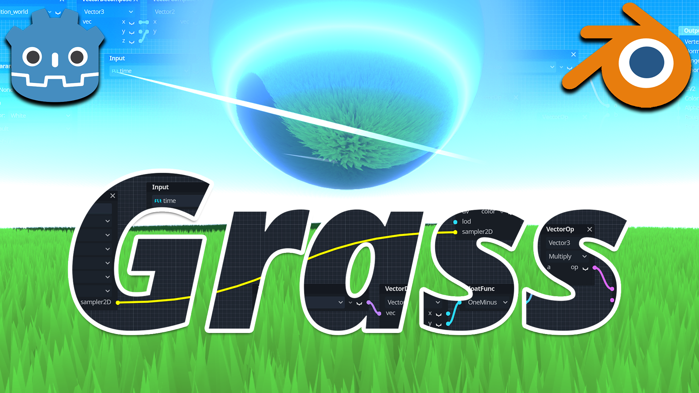
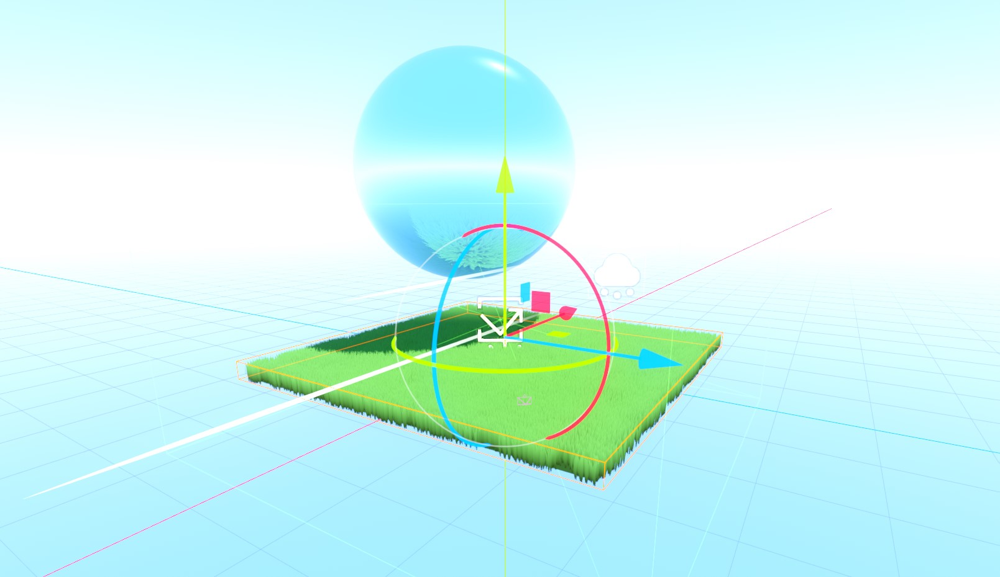

# 🌾 Godot 4 Stylized Grass — Ghibli & Wind Waker Rolling Meadows

> **Category:** 🗡️ Stylized Adventure / Foliage & Shaders  
> **Repository:** [bramreth/Godot-4-3D-Stylized-Grass](https://github.com/bramreth/Godot-4-3D-Stylized-Grass)  
> **Developer / Author:** `bramreth`  
> **License:** MIT License  
> **Stars:** Small account (58 stars)  
> **Engine:** Godot 4.x + Blender  

---

## 📸 In-Engine Screenshots

| Rolling Ghibli Stylized Grass Field | In-Editor Material Setup |
| :---: | :---: |
|  |  |

---

## 🌟 Project Overview
This repository provides a complete pipeline for creating lush, rolling, wind-swept cartoon grass fields in Godot 4. It replicates the signature look of Studio Ghibli fields and *Zelda: Wind Waker / Breath of the Wild* with minimal GPU performance cost.

---

## 🎮 Key Features & Mechanics
- **Simplex Noise Wind Displacement:**
  - Dynamic wave ripples across the grass carpet synchronized to ambient wind vectors.
- **Root-to-Tip Color Gradient Remapping:**
  - Deep verdant shadows at the base transitioning into sunlit golden tips.
- **Pixel-Jitter Elimination:**
  - Custom LOD meshes tuned in Blender to prevent shimmering artifacts at distance.

---

## 🛠️ Tech Stack & Architecture
- **Engine:** Godot 4.x.
- **Pipeline:** Blender low-poly grass clumps + Godot GDShader.

---

## 📋 How to Clone & Run

```bash
git clone https://github.com/bramreth/Godot-4-3D-Stylized-Grass.git
```

Import `project.godot` in **Godot 4** and run `res://scenes/main.tscn`.
