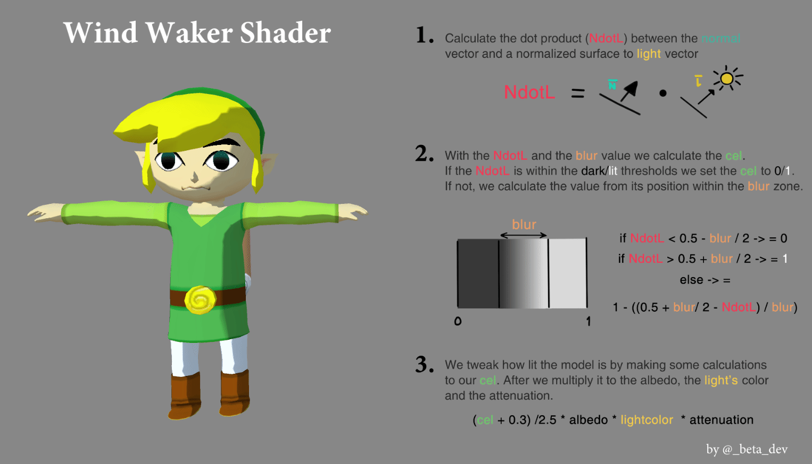

# 🎨 Wind Waker Shader — Faithful Nintendo GameCube Toon Lighting

> **Category:** 🗡️ Stylized Adventure / Toon Shaders  
> **Repository:** [albertomelladoc/Wind-Waker-Shader](https://github.com/albertomelladoc/Wind-Waker-Shader)  
> **Developer / Author:** Alberto Mellado (`albertomelladoc`)  
> **License:** MIT License  
> **Stars:** Small account (59 stars)  
> **Engine:** Unity (ShaderLab / Cg)  

---

## 📸 In-Engine Screenshots

| Faithful Wind Waker Two-Band Toon Lighting & Inverted Hull Silhouette |
| :---: |
|  |

---

## 🌟 Project Overview
**Wind-Waker-Shader** is a faithful technical reproduction of Nintendo's two-threshold lighting algorithm from *The Legend of Zelda: The Wind Waker* (Nintendo GameCube, 2002).

It solves the sharp stepping problem by introducing subtle gradient transition bands, paired with an inverted hull silhouette outline pass that produces authentic hand-drawn cartoon outlines.

---

## 🎮 Key Features & Mechanics
- **Two-Threshold Lighting Function:**
  - Renders bright key light, halftone, and deep ambient shadow with soft transition bands.
- **Inverted Hull Outlines:**
  - Second shader pass pushing back-facing normals along their vertex normals.
- **Dynamic Specular Hotspots:**
  - Snappy cartoon specular glints that react to light position.

---

## 🛠️ Tech Stack & Architecture
- **Engine:** Unity.
- **Language:** ShaderLab / Cg.

---

## 📋 How to Clone & Run

```bash
git clone https://github.com/albertomelladoc/Wind-Waker-Shader.git
```

Open in **Unity** and open `Assets/Scenes/SampleScene.unity`.
