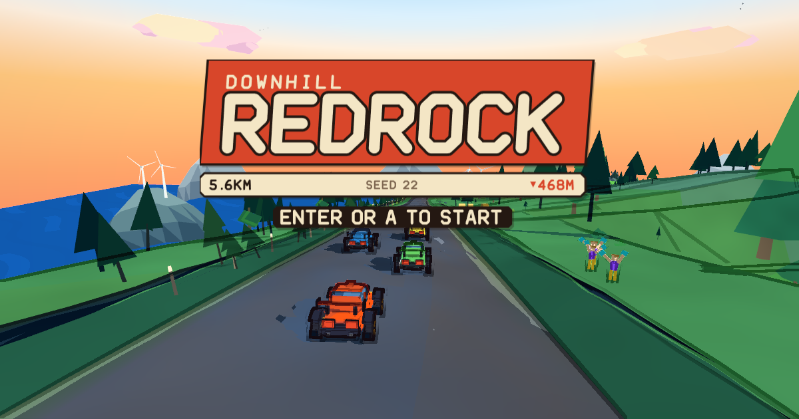

# 🏎️ Redrock — AI Vibe-Coded Cel-Shaded Downhill Racer in Three.js

> **Category:** 🌐 WebGL & Toon AI / Cel-Shaded Racing  
> **Repository:** [StarKnightt/redrock](https://github.com/StarKnightt/redrock)  
> **Developer / Author:** `StarKnightt`  
> **License:** ISC License  
> **Stars:** Small account (8 stars)  
> **Tech Stack:** Pure Three.js (Zero external binary assets)  
> **Live Demo:** [starknightt.github.io/redrock/](https://starknightt.github.io/redrock/)  

---

## 📸 In-Game Screenshots

| Cel-Shaded Comic Downhill Desert Racing |
| :---: |
|  |

---

## 🌟 Project Overview
**Redrock** is an exhilarating downhill canyon racing game built in Three.js with a distinct comic-book cel-shaded aesthetic. It was developed through **AI vibe coding** from a single ambitious prompt (`PROMPT.md`), iteratively critiqued by AI sub-agents.

The entire game is 100% procedural code: no 3D models, no texture files, and no audio files!

---

## 🎮 Key Features & Mechanics
- **Custom Cel-Shading & Quantized Lighting:**
  - Sharp comic light steps with warm desert canyon palettes.
- **Screen-Space Outline Pass:**
  - Edge detection pass combining depth, normal, and object-class buffers. Dust clouds naturally occlude outlines.
- **Synthesized FM Audio DSP:**
  - Real-time procedural audio synthesis simulating engine revs, gear shifts, and tire screeching.

---

## 🛠️ Tech Stack & Architecture
- **Graphics:** Three.js + WebGL.
- **Audio:** Web Audio API procedural synthesis.
- **Architecture:** Zero-asset procedural codebase.

---

## 📋 How to Clone & Run

```bash
git clone https://github.com/StarKnightt/redrock.git
cd redrock
npm install
npm run serve
```

Open `http://localhost:8080` in your browser.
