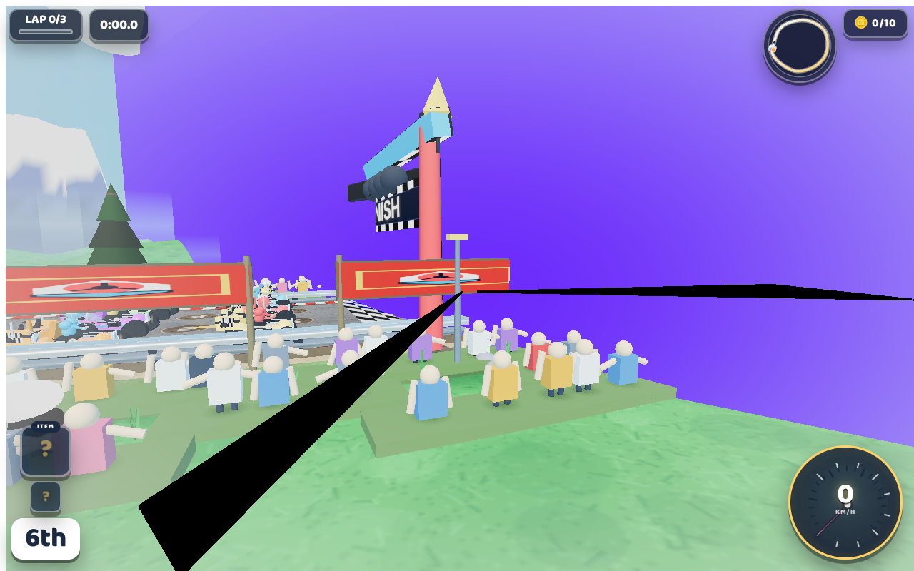

# 🏁 Super Kart 3D.js — Vibrant Cartoon Arcade Kart Racer in Three.js

> **Category:** 🌐 WebGL & Toon AI / Cartoon Racing  
> **Repository:** [fecolinhares/super-kart-3djs](https://github.com/fecolinhares/super-kart-3djs)  
> **Developer / Author:** Feco Linhares (`fecolinhares`)  
> **License:** MIT License  
> **Stars:** Small account (0 stars)  
> **Tech Stack:** Three.js + Vite + Web Audio API  
> **Live Demo:** [fecolinhares.github.io/super-kart-3djs/](https://fecolinhares.github.io/super-kart-3djs/)  

---

## 📸 In-Game Screenshots

| Desktop Cartoon Circuit Racing | Mobile Optimized Touch Controls |
| :---: | :---: |
|  |  |

---

## 🌟 Project Overview
**Super Kart 3D.js** is a fast, colorful cartoon kart racing game built in Three.js. It delivers classic arcade kart gameplay with stepped toon materials, rim lighting, post-processing bloom, screen shake on impact, and playful squash & stretch kart deformation.

---

## 🎮 Key Features & Mechanics
- **Juicy Cartoon Physics:**
  - Drifting, boost pads, jumping ramps, and kart squash/stretch on landings.
- **Post-Processing Pipeline:**
  - High-intensity bloom for turbo boosters, vignette, and motion blur.
- **Dynamic Circuits:**
  - Palm beach circuits and a 48-tower neon metropolis nighttime skyline (`?track=2`).

---

## 🛠️ Tech Stack & Architecture
- **Engine:** Three.js.
- **Bundler:** Vite.
- **Language:** JavaScript.

---

## 📋 How to Clone & Run

```bash
git clone https://github.com/fecolinhares/super-kart-3djs.git
cd super-kart-3djs
npm install
npm run dev
```

Open `http://localhost:5173` in your browser.
