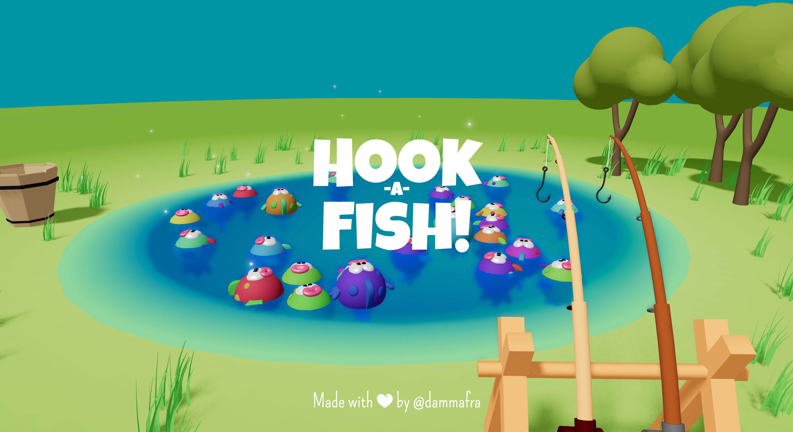
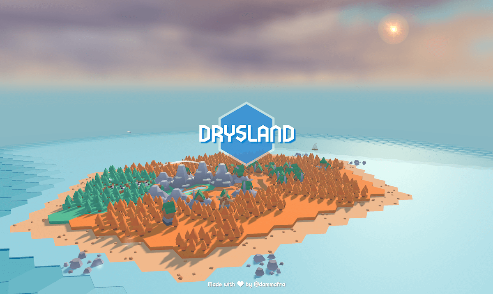

# 🎣 Hook-A-Fish & Drysland — Award-Winning Tactile Toy & Diorama Games

> **Category:** 🌐 WebGL & Toon AI / Tactile 3D Dioramas  
> **Repositories:** [dammafra/hook-a-fish](https://github.com/dammafra/hook-a-fish) & [dammafra/drysland](https://github.com/dammafra/drysland)  
> **Developer / Author:** Francesco Dammacco (`dammafra`)  
> **Licenses:** GNU AGPL-3.0  
> **Stars:** Small accounts (43 stars & 93 stars)  
> **Accolades:** 🥇 1st Place Winner — Three.js Journey Challenges #017 & #019  
> **Live Demos:** [hook-a-fish.dammafra.dev](https://hook-a-fish.dammafra.dev) & [drysland.dammafra.dev](https://drysland.dammafra.dev)  

---

## 📸 In-Game Screenshots

| Hook-A-Fish Tactile Toy Arcade Game | Drysland Hexagonal Floating Island Maze |
| :---: | :---: |
|  |  |

---

## 🌟 Project Overview
Created by Francesco Dammacco, these two award-winning Three.js experiences showcase peak tactile aesthetic design:
1. **Hook-A-Fish:** Recreates the nostalgic battery-operated rotating toy fishing game with tactile plastic shaders, translucent water reflections, and Rapier3D physics.
2. **Drysland:** A peaceful hexagonal floating island puzzle with procedural maze trees, glowing water channels, and fluttering wind trails.

---

## 🎮 Key Features & Mechanics
- **Tactile Toy Aesthetics:**
  - Shaders that look like real molded plastic and soft rubber toys.
- **Rapier3D Physics Integration:**
  - Dynamic line tension, swinging magnetic hooks, and snapping fish jaws.
- **Procedural Island Maze:**
  - Solvable hexagonal growing-tree island generators with interactive water locks.

---

## 🛠️ Tech Stack & Architecture
- **Hook-A-Fish:** React Three Fiber + `@react-three/rapier` + Zustand.
- **Drysland:** Pure Three.js + GSAP + Tailwind CSS.

---

## 📋 How to Clone & Run

```bash
# Hook A Fish
git clone https://github.com/dammafra/hook-a-fish.git
cd hook-a-fish && npm install && npm run dev

# Drysland
git clone https://github.com/dammafra/drysland.git
cd drysland && npm install && npm run dev
```
