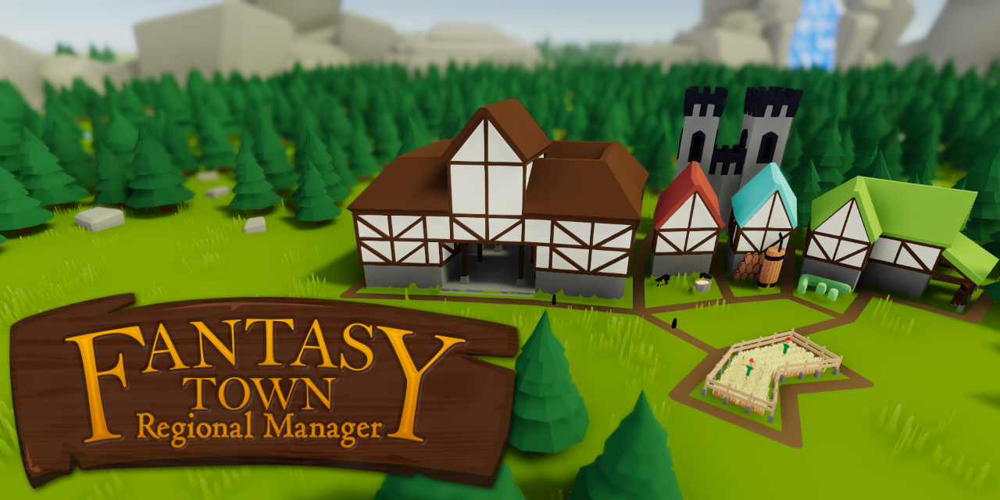

# Fantasy Town Regional Manager

> **Repository:** [CapsCollective/ozymandias](https://github.com/CapsCollective/ozymandias)
> **⭐ Stars:** 19 | **Sprache:** C# | **Lizenz:** Custom
> **Engine:** Unity | **Kategorie:** 🏙️ Cozy City & Town Builder

## Beschreibung

Roguelite fantasy town builder + card game. Build taverns, attract adventurers, fend off monsters. Turn-based gameplay with cute low-poly fantasy buildings.

## Warum visuell ansprechend?

Colorful fantasy buildings, adventurer characters, card-based building mechanics — charming and strategic.

## Screenshots




## Klonen & Starten

```bash
git clone https://github.com/CapsCollective/ozymandias.git && open in Unity
```

## Technische Details

| Eigenschaft | Wert |
|-------------|------|
| Repository | [CapsCollective/ozymandias](https://github.com/CapsCollective/ozymandias) |
| Stars | ⭐ 19 |
| Sprache | C# |
| Engine | Unity |
| Lizenz | Custom |
