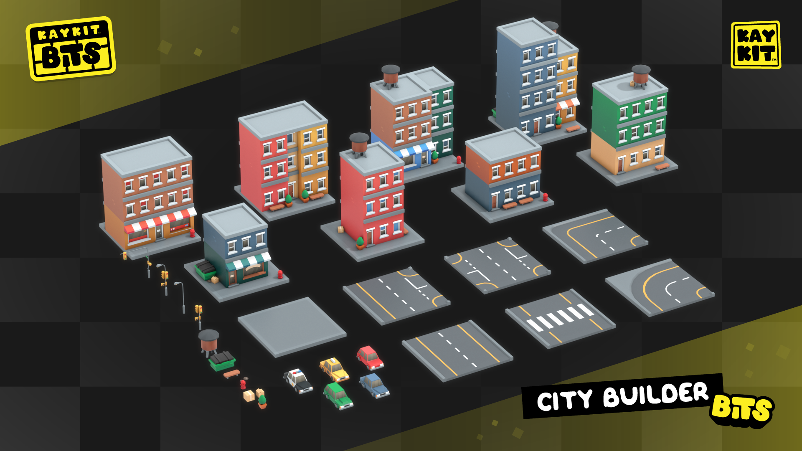

# KayKit City Builder Bits (CC0 Assets)

> **Repository:** [KayKit-Game-Assets/KayKit-City-Builder-Bits-1.0](https://github.com/KayKit-Game-Assets/KayKit-City-Builder-Bits-1.0)
> **⭐ Stars:** 39 | **Sprache:** 3D Assets | **Lizenz:** CC0
> **Engine:** Universal (OBJ/FBX/GLTF) | **Kategorie:** 🏙️ Cozy City & Town Builder

## Beschreibung

32+ free CC0 low-poly city assets: roads, buildings, vehicles, trees. Perfect base for any city builder. Compatible with Unity, Godot, Unreal, Roblox.

## Warum visuell ansprechend?

Professional-quality stylized low-poly city models, gradient atlas texture, mobile-ready optimization.

## Screenshots





## Klonen & Starten

```bash
git clone https://github.com/KayKit-Game-Assets/KayKit-City-Builder-Bits-1.0.git
```

## Technische Details

| Eigenschaft | Wert |
|-------------|------|
| Repository | [KayKit-Game-Assets/KayKit-City-Builder-Bits-1.0](https://github.com/KayKit-Game-Assets/KayKit-City-Builder-Bits-1.0) |
| Stars | ⭐ 39 |
| Sprache | 3D Assets |
| Engine | Universal (OBJ/FBX/GLTF) |
| Lizenz | CC0 |
