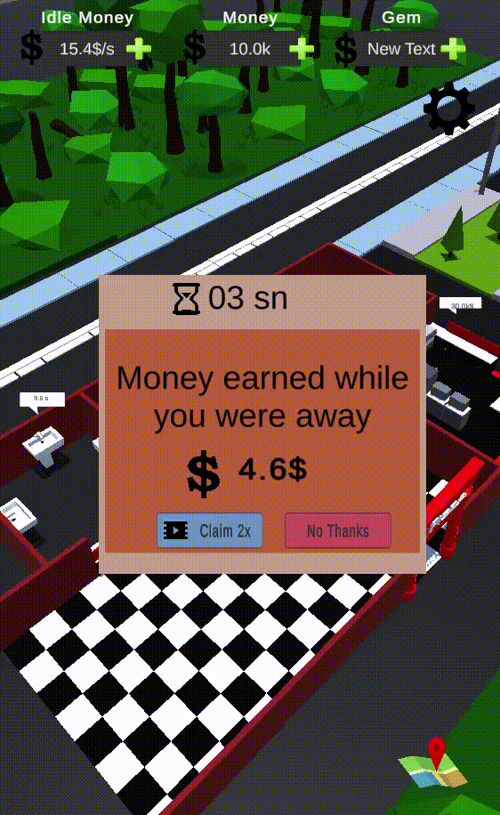

# Idle Restaurant Tycoon

> **Repository:** [eminkarakaya/Idle-Restaurant](https://github.com/eminkarakaya/Idle-Restaurant)
> **⭐ Stars:** 22 | **Sprache:** C# | **Lizenz:** None
> **Engine:** Unity | **Kategorie:** 🏙️ Cozy City & Town Builder

## Beschreibung

3D Restaurant tycoon with DOTween animations, AI state machines, Unity NavMesh. Published on Google Play. Cute low-poly restaurant with customer/chef AI.

## Warum visuell ansprechend?

Polished 3D tycoon with animated characters, DOTween juice, and real Play Store release.

## Screenshots




## Klonen & Starten

```bash
git clone https://github.com/eminkarakaya/Idle-Restaurant.git && open in Unity
```

## Technische Details

| Eigenschaft | Wert |
|-------------|------|
| Repository | [eminkarakaya/Idle-Restaurant](https://github.com/eminkarakaya/Idle-Restaurant) |
| Stars | ⭐ 22 |
| Sprache | C# |
| Engine | Unity |
| Lizenz | None |
