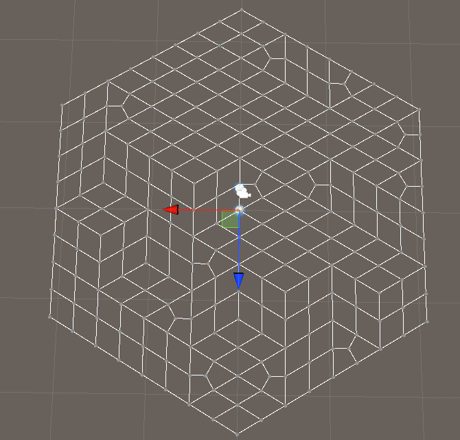
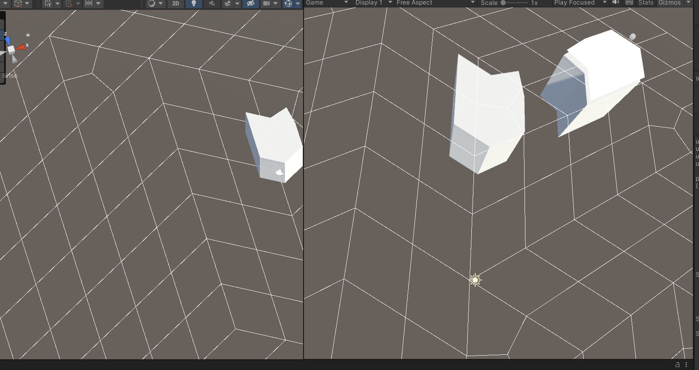

# TownScaper Demo (Chinese WFC)

> **Repository:** [YaoYao-Pig/TownScaper](https://github.com/YaoYao-Pig/TownScaper)
> **⭐ Stars:** 7 | **Sprache:** C# | **Lizenz:** None
> **Engine:** Unity | **Kategorie:** 🏙️ Cozy City & Town Builder

## Beschreibung

Detailed Townscaper reproduction with hex grid generation, marching cubes, WFC (Wave Function Collapse), click-to-build/destroy. Excellent technical breakdown.

## Warum visuell ansprechend?

Faithful Townscaper mechanics, colorful hex grids, procedural buildings, clean technical documentation.

## Screenshots






## Klonen & Starten

```bash
git clone https://github.com/YaoYao-Pig/TownScaper.git && open in Unity
```

## Technische Details

| Eigenschaft | Wert |
|-------------|------|
| Repository | [YaoYao-Pig/TownScaper](https://github.com/YaoYao-Pig/TownScaper) |
| Stars | ⭐ 7 |
| Sprache | C# |
| Engine | Unity |
| Lizenz | None |
