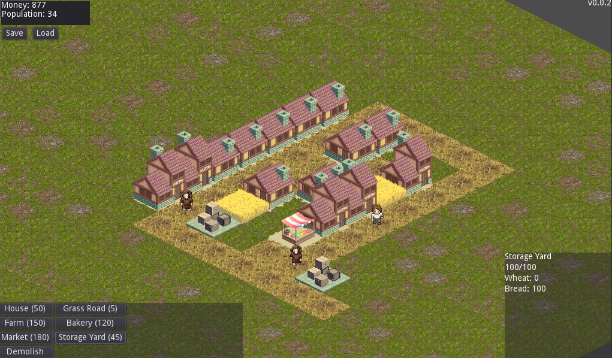

# Open City Prototype (Pharaoh-like)

> **Repository:** [game-prototypes/open-city-prototype](https://github.com/game-prototypes/open-city-prototype)
> **⭐ Stars:** 9 | **Sprache:** GDScript | **Lizenz:** None
> **Engine:** Godot 3 | **Kategorie:** 🏙️ Cozy City & Town Builder

## Beschreibung

Pharaoh-inspired city builder prototype in Godot. Grid-based building placement with ancient Egyptian aesthetic. Clean GDScript code with unit tests.

## Warum visuell ansprechend?

Ancient city builder vibes, clean Godot prototype, isometric grid with buildings and roads.

## Screenshots




## Klonen & Starten

```bash
git clone https://github.com/game-prototypes/open-city-prototype.git && godot project.godot
```

## Technische Details

| Eigenschaft | Wert |
|-------------|------|
| Repository | [game-prototypes/open-city-prototype](https://github.com/game-prototypes/open-city-prototype) |
| Stars | ⭐ 9 |
| Sprache | GDScript |
| Engine | Godot 3 |
| Lizenz | None |
